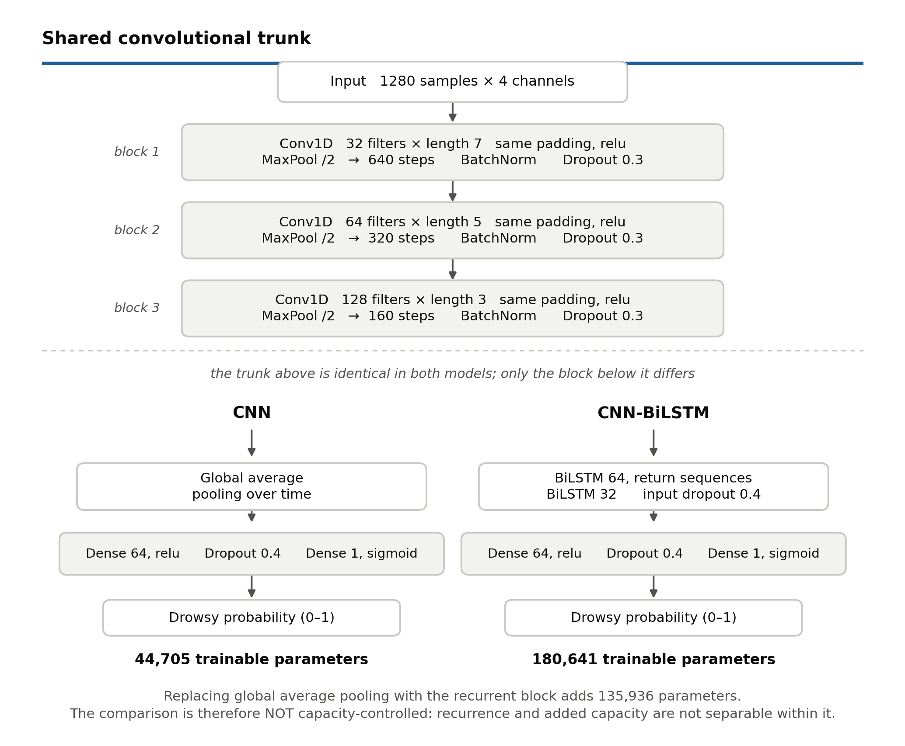
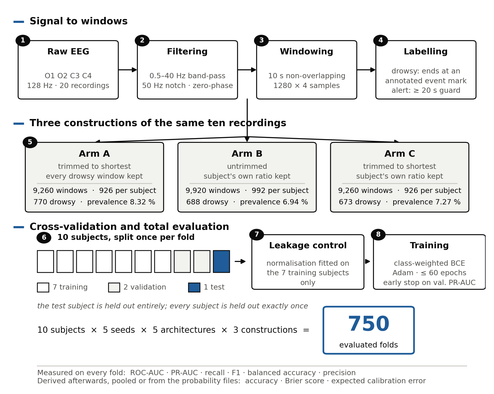
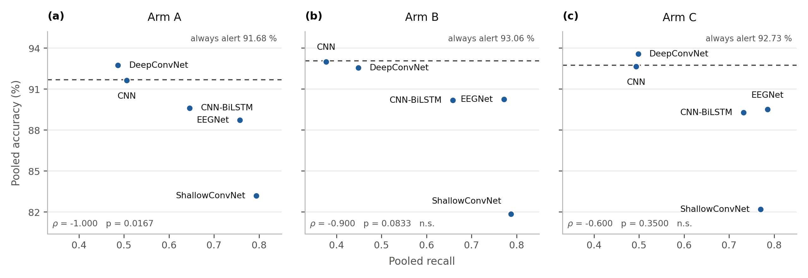
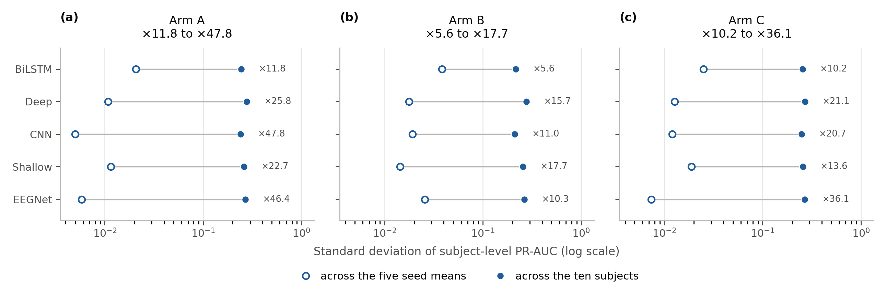
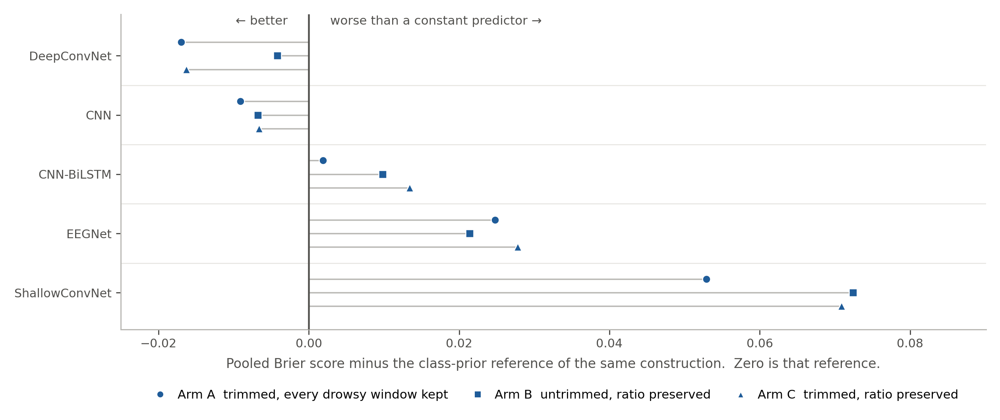
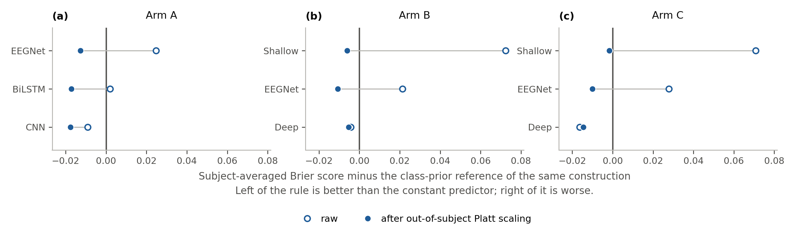

## Title

**Calibration of Four-Channel EEG for Driver Drowsiness Detection:
A 750-Fold Leave-One-Subject-Out Study**

Hari Singh Jatav ^a^, Mitul Kumar Ahirwal ^b,^\*

^a^ Centre for Artificial Intelligence, Maulana Azad National Institute of
Technology Bhopal, Bhopal, Madhya Pradesh 462003, India

^b^ Department of Computer Science and Engineering, Maulana Azad National Institute
of Technology Bhopal, Bhopal, Madhya Pradesh 462003, India

\* Corresponding author. E-mail address: mkahirwal@manit.ac.in (M. K. Ahirwal)

---

## Abstract

Reported accuracies for EEG-based driver-drowsiness detection routinely exceed 90 %,
yet cannot be interpreted without the class ratio and the majority-class baseline.
We evaluate EEGNet, ShallowConvNet, a one-dimensional CNN, DeepConvNet and a CNN-
BiLSTM on a four-channel montage under leave-one-subject-out cross-validation with
five seeds, across three window-set constructions of the same ten recordings, giving
750 folds. A finding is claimed for all three only where it replicates on all three;
the three are cells of a two-by-two design of trimming against balancing, giving two
single-factor contrasts.

Accuracy orders these architectures against recall. On all three, the two most
accurate are exactly the two with the lowest recall; the accuracy-recall rank
correlation is −1.000, −0.900 and −0.600, reaching the nominal level on the first
alone. On one, the only architecture exceeding the 92.73 % always-alert
baseline misses 338 of 673 drowsy windows.

Ranking quality and probability reliability separate. Against the Brier score of a
constant predictor emitting the class prior, three of the five (including EEGNet,
the highest subject-averaged ROC-AUC everywhere) score worse, and the partition is
identical on all three. A per-fold logistic recalibration fitted on the
other nine subjects brings every measured architecture below the reference on all
three, leaving subject-averaged ROC-AUC and PR-AUC unchanged at the reported
precision where released scores permit measuring it (Arm A). EEGNet improves its
calibration error on all three, leads all twelve paired comparisons and separates in
eleven; no other pair separates on ROC-AUC. All 750 per-fold results and the
pipeline are released.

---

## Highlights

- Five EEG models, leave-one-subject-out, three window constructions, 750 folds
- The two most accurate models are exactly the two with the lowest recall
- Three of five models score worse than a constant predictor of the class prior
- Recalibration closes the gap; ranking unchanged where measured (Arm A)
- All 750 per-fold results and the full analysis pipeline are released

---

## Keywords

Electroencephalography; driver drowsiness detection; leave-one-subject-out
cross-validation; probability calibration; class imbalance; convolutional neural
networks; reproducibility

---

## Declaration of competing interest

> The authors declare that they have no known competing financial interests or
> personal relationships that could have appeared to influence the work reported in
> this paper.

## CRediT author contribution statement

> **Hari Singh Jatav:** Conceptualization, Methodology, Software, Investigation,
> Data curation, Writing – original draft, Visualization.
> **Mitul Kumar Ahirwal:** Conceptualization, Methodology, Validation, Writing –
> review & editing, Supervision.

## Acknowledgements

> The work was conducted and supported by the Brain–Computer Interface Laboratory,
> Department of Computer Science and Engineering, Maulana Azad National Institute
> of Technology Bhopal, India. The authors acknowledge the depositors of the
> Drivers Drowsiness Database for making the recordings publicly available.

## Funding

> This research did not receive any specific grant from funding agencies in the
> public, commercial, or not-for-profit sectors.

---

---

# 1. Introduction

Driver drowsiness is a condition that a monitoring system must detect *before*
it produces a lapse, and electroencephalography is the modality closest to the
state itself rather than to its consequences. A camera sees a closed eyelid; the
EEG sees the cortical change that precedes it. That advantage is why the field
is large and well surveyed, and why its reported performance is high: across 69
studies reviewed to August 2025, the median reported accuracy is 94.48 % for
deep-learning methods and 91.80 % for classical machine learning [S2], and an
EEG-specific survey of 87 papers records figures up to 99.23 % [S1].

**Those numbers cannot be read.** Not because they are implausible, but because
accuracy on a rare-event problem cannot be interpreted without two quantities that the
reviewed papers largely do not report: the class ratio of the evaluation set,
and the accuracy of the trivial predictor that always answers with the majority
class. On the data used here, "always alert" scores between 91.68 % and 93.06 %
depending on the construction. Against that, the 94.48 % median of the reviewed
deep-learning studies is a margin of a few points at most, and on a dataset whose
prevalence is not reported, the margin cannot be computed at all. The figure is
not implausible; it is unreadable.

This paper is an attempt to evaluate the same familiar architectures in a way
that does not have that problem, and to report honestly what survives.

## What we found by asking three questions the field has not asked together

**Does the finding survive a different preprocessing decision?** Turning continuous
recordings with event marks into labelled windows requires choices the raw data does
not make (whether to trim recordings to a common length, how to handle each subject's class ratio), and those choices move the prevalence, which moves every
threshold-dependent metric. We therefore built **three constructions of the same ten
recordings** and report which findings hold on all three. They are three cells of a
two-by-two design of trimming against balancing, **the fourth not evaluated**; the
three still yield two contrasts, each varying one factor. The answer is asymmetric:
balancing produces seven significant differences across twenty paired tests, trimming
none, its smallest p being 0.1309. With ten subjects that null is weak evidence, and
the paper says "no measurable effect" rather than "no effect" throughout.

The discipline is costly: it removed two claims a single construction would have
supported. An inverse relationship between parameter count and ranking quality decays
ρ = −0.900 → −0.500 → −0.100 across the three and reaches significance on none, so it
is withdrawn, as is the claim that the deepest architecture ranks worst, true on two constructions and false on the third.

**Are the probabilities any good, as probabilities?** A separate question from
whether the model ranks windows correctly. Outside EEG it is routine: neural networks
are systematically over-confident [P1], and discrimination and calibration are
understood as separate properties, so a model that ranks cases correctly may still
mis-state absolute risk badly enough to be the wrong choice [P2]. Here, as a checkable
statement, **none of the three most recent reviews of this field treats the
calibration of predicted probabilities as an evaluation dimension** [S1, S2, S3]: verified by full-text search: *Brier*, *probability calibration*, *Platt*,
*isotonic*, *expected calibration error* and *reliability diagram* occur in none of
them. The 2026 review names the problem that makes it matter, that accuracy "can be
misleading in imbalanced settings where drowsy samples are relatively rare", yet its
own vocabulary stops at accuracy, precision, recall, specificity and F1 [S3], five metrics that all presuppose a threshold and none of which can detect a mis-stated
probability.

Asking it here produces the paper's central result. Scored against the Brier score of
a constant predictor that ignores the EEG and emits the class prior, **three of the
five architectures are worse than that constant**, including the one with the highest
subject-averaged ROC-AUC on all three constructions, and the partition of the five
about that reference is *identical* on all three, despite three different prevalences.
Ranking quality and probability reliability are separable, and here they separate.

The gap is repairable, and cheaply: a two-parameter logistic function fitted per fold
**on the other nine subjects only** brings every measured architecture below the
reference on every construction, while leaving the ordering essentially untouched, a condition checked rather than assumed (Section 7.6). The ordering information was
already present; only its mapping onto the probability scale was wrong.

**What does the uncertainty actually come from?** With ten subjects an interval over
random seeds describes almost nothing [E2]. For subject-level PR-AUC, between-subject
spread exceeds between-seed spread by roughly an order of magnitude on every
construction, 12 to 48 times on Arm A, 6 to 18 on Arm B, 10 to 36 on Arm C. Worse,
when one construction was executed twice under identical settings, differing only in
GPU non-determinism, two of three architectures moved an individual subject's mean by
more than the standard deviation this paper reports as its ±.

## Contributions

1. **A three-construction evaluation protocol**, in which a finding is claimed only
   where it replicates on all three window-set constructions of the same recordings
   and is otherwise reported with the constructions it covers named, and in which two
   pairs of constructions each isolate one construction choice. Two claims a single
   construction would have supported are withdrawn under it, and the two choices
   differ sharply: balancing moves results, trimming does not.

2. **An evaluation of probability reliability for EEG drowsiness detection**, a
   dimension none of the three most recent reviews treats, finding that three of five
   architectures (including the highest-ranking one) score worse than a constant
   predictor emitting the class prior, with the same partition on all three
   constructions. *We do not claim priority*: no systematic
   search for earlier reports was performed, so no claim to be first is made. What is stated instead is checkable.

3. **A demonstration that the gap is one of scale rather than of ordering**:
   out-of-subject logistic recalibration, fitted per fold on the other nine subjects,
   removes it on every construction with the **subject-averaged** ROC-AUC and PR-AUC
   unchanged at the reported precision, measured rather than inferred, on the three
   Arm A architectures whose per-window scores are released, three of fifteen
   architecture-by-arm cells. The invariance is not claimed for pooled metrics.

4. **Evidence that accuracy does not merely fail to separate these architectures but
   orders them against recall.** On all three constructions **the two most accurate
   architectures are exactly the two with the lowest recall** (ρ = −1.000, −0.900,
   −0.600, only the first clearing the exact threshold), and on Arm C the single
   architecture exceeding the always-alert baseline detects 335 of 673 drowsy windows.
   What accuracy does **not** license is a general ranking: that same architecture
   attains the best pooled Brier score and the highest pooled precision, while the best
   ROC-AUC belongs to one of the three worse than the constant predictor. No
   architecture here wins on every measure.

5. **A mechanism for when out-of-subject threshold selection helps**, in place of the
   blanket negative a single construction supports: it transfers between subjects when
   a model's scores are stably offset in one direction, and not otherwise.

6. **A quantification of execution non-determinism**, which single-run comparisons do
   not report: where measured, a single subject's mean moved further between two
   identical runs than the seed-level ± this paper reports. It covers three
   architectures on one construction and one on a second, so **for every architecture
   not covered the reported ± is a lower bound**.

7. **A complete, tested, released pipeline.** All 750 per-fold results are published
   with code regenerating every table and significance test from them, without a GPU
   and without the recordings; a registry records every value the manuscript may cite
   and an automated scan reports any figure absent from it.

What this study does *not* establish: three constructions of ten recordings are not
three datasets, and nothing here is external replication. The surviving architecture
ranking is narrow: EEGNet exceeds every alternative and **no other pair separates
significantly on ROC-AUC on any construction**, though those same pairs do separate on
balanced accuracy, so the limit is on ranking quality rather than distinguishability.
Calibration is measured on three of the five architectures per construction. These
bounds are stated where they bite and collected in Section 8.10.

## Organisation

Section 2 reviews the relevant work and Section 3 the four gaps that set the design.
Section 4 describes the dataset and the three constructions, Section 5 the five
architectures, Section 6 the evaluation protocol and its two averaging conventions.
Section 7 reports the results, Section 8 discusses what they license, Section 8.10 the
limitations, and Section 9 concludes.

---

---

# 2. Related Work

## 2.1 What the field detects, and how it reports it

EEG-based driver-drowsiness detection is active and well surveyed. The most recent
EEG-specific survey screened 267 records and analysed 87 papers [S1]; a parallel
systematic review covering 69 studies to August 2025 reports a median accuracy of
94.48 % for deep-learning methods and 91.80 % for classical machine learning, with
individual figures spanning 67 % to 100 % [S2]; and a 2026 comparative review gives
64 % to 98.7 % for physiological systems, with the explicit caution that such ranges
"should not be interpreted as directly comparable benchmark values" [S3].

Those numbers are this paper's starting point, and not because they are too high.
They are difficult to interpret without two quantities that are usually absent: **the
class ratio of the evaluation set, and the accuracy of the trivial always-majority
predictor on it.** An accuracy of 94.48 % is excellent on a balanced problem and worse
than predicting "alert" forever at 6 % prevalence. The reviews cannot supply the
missing context because the reviewed papers largely do not report it; the broader
review rates 27 of its 69 studies at high risk of bias, citing "dataset construction,
labeling procedures, insufficient reporting of ground-truth generation, and inadequate
validation strategies" [S2].

The 2026 review names the problem without pursuing its consequence — accuracy "can be
misleading in imbalanced settings where drowsy samples are relatively rare", with a
call to "move beyond accuracy-centered comparisons" [S3] — while its own vocabulary
stops at accuracy, precision, recall, specificity and F1, all threshold metrics
computed after a decision has been taken. This study extends that concern with a
measurement: on all three constructions the two most accurate architectures are
exactly the two with the lowest recall (Section 7).

None of the three reviews treats probability calibration as an evaluation dimension,
and none mentions it at all: *Brier*, *probability calibration*, *Platt*, *isotonic*,
*expected calibration error* and *reliability diagram* occur in none of the three full
texts. That is deliberately a claim about the reviews: their silence is evidence
about them, not proof that no study has ever calibrated an EEG drowsiness model. What
can be said without a negative search result is that the apparatus is standard
elsewhere (Section 2.4), that **these three reviews do not treat it as a distinct
evaluation dimension**, and that applied here it does not behave like a formality.
That is the gap this paper is built around.

## 2.2 Architectures

The architectures evaluated here are not new, and that is deliberate; two lines of
work supply all five.

**Compact, EEG-specific convolutions.** EEGNet [A1] factorises the problem the way the
signal is structured (a temporal filter bank across channels, a depthwise spatial convolution learning per-channel combinations, then a separable convolution), reaching
its published performance across four BCI paradigms with, in the configuration used
here, 1,809 trainable parameters. **ShallowConvNet** and **DeepConvNet** [A2] come
from the other direction: the shallow network mimics a filter-bank common spatial
pattern pipeline in ~14 k parameters, the deep network stacks five convolution–pooling
stages to ~150 k. These three span two orders of magnitude of capacity while remaining
architectures designed for EEG rather than borrowed from vision.

The other two are the generic baselines most often built for this task: a three-block
one-dimensional CNN, and the same CNN with its global temporal pooling replaced by two
bidirectional LSTM layers. They share the convolutional trunk, so the feature
extractor is fixed and the substitution changes only how the time axis is reduced.
**It also adds 135,936 parameters (3.04 times the CNN's own total, taking the
CNN-BiLSTM to 4.04 times it), so this is not a capacity-neutral ablation**, and
recurrence cannot be separated here from the added parameters; Section 7 reports the
comparison with that limit stated. The survey literature records CNN and CNN-LSTM
hybrids as the dominant deep architectures in this field [S2], so the pair is also the
comparison a reader is most likely to want.

**No hyperparameters were searched, and the architectures were fixed before any result
was seen.** EEGNet, ShallowConvNet and DeepConvNet were taken from their authors'
reference implementations without architectural change beyond the output-layer
adaptation of Section 5; the CNN and CNN-BiLSTM have no published configuration to
adopt and were fixed in advance rather than tuned. This bounds the claim — the
comparison is between these configurations, not between architectures at their best,
and for two of the five the configuration is ours — but it buys the fact that no
search was fitted to ten subjects.

## 2.3 The closest cross-subject work

A drowsiness detector is deployed on a driver it has never seen, so evaluation should
hold out whole subjects; a protocol mixing one subject's windows across training and
test measures something closer to within-subject memorisation.

The strongest cross-subject work adopts this explicitly: Cui et al. [C1] evaluate a
compact separable-convolution network on 11 subjects under leave-one-subject-out
cross-validation, reporting 78.35 % mean accuracy against conventional baselines at
53.40–72.68 % and earlier deep methods at 71.75–75.19 %. It is the closest
methodological neighbour to this study: the same leave-one-subject-out protocol, a
separable-convolution architecture of the same family as EEGNet, and a comparable
subject count. **It is a different dataset and a different recording protocol**, so
its figures are not a benchmark competed against; they are a reminder of what honest
cross-subject performance looks like, well below the 94 % medians of the aggregate
reviews.

Their evaluation set is also imbalanced, and the comparison is instructive: 2,952
samples of which 1,221 are drowsy, a prevalence of 41.4 % against 6.94 % to 8.32 %
here. **Their reported accuracy therefore clears its own always-alert baseline of
58.6 % by roughly twenty points, where ours does not.** The same number that is
uninterpretable on this dataset is informative on theirs, and the difference is the
class ratio, not the architecture. Their per-subject distributions vary widely, so a
pooled prevalence understates how uneven the comparison is subject by subject; the
point stands at the aggregate level, which is where they report.

Neither survey establishes how common subject-independent evaluation actually is. [S2]
gives the reason — "incomplete reporting in several studies, including missing details
on sample characteristics, annotation methods, and validation schemes restricts the
reliability of cross-study synthesis" — and [S1] makes no such statement, so this is
one review's finding and not two. That is itself the finding.

## 2.4 Calibration: a literature this field has not drawn on

Outside EEG, the separation of *discrimination* from *calibration* is well
established. Guo et al. [P1] showed that modern neural networks are systematically
over-confident, the effect growing as architectures grew; Van Calster et al. [P2],
writing for clinical prediction, put the consequence plainly: a model can rank cases
correctly while systematically mis-stating absolute probabilities, and one with
slightly lower AUC but better calibration can be the more useful in practice.

The remedies are long-established and cheap: Platt scaling fits a two-parameter
logistic function to the score [P5], isotonic regression a non-parametric
non-decreasing map [P4]. **The two differ in their effect on ranking, because isotonic
regression can introduce ties through its flat regions whereas a logistic map is
strictly increasing when its fitted slope is positive.**

That condition was measured rather than assumed, and the measurement is reported in
Section 7.6: on the construction whose per-window scores were retained all 150 fitted
Platt slopes are positive, the subject-averaged ROC-AUC and PR-AUC are unchanged at
the reported precision, and isotonic regression behaves as its weaker monotonicity
predicts, lowering both on most of the same folds. Reliability is measured by the
Brier score [P6] and by the binned expected calibration error [P3].

**This paper's contribution is to bring that apparatus to EEG drowsiness detection and
to find that it is not a formality here.** Three of the five architectures (including
the one with the highest subject-averaged ROC-AUC on every construction) produce
probabilities whose Brier score is *worse than a constant predictor that ignores the
EEG entirely and emits the class prior*, and the partition of the five about that
reference is identical on all three constructions. The Brier score is computed for all
five on all three; the recalibration analysis covers the three architectures per
construction whose per-window probabilities were retained, and the two coverages are
not to be read as one.

Two details matter for comparison with other work. First, every calibrator is
fitted **out of subject**: one per leave-one-subject-out fold, on the other nine
subjects only. Fitting a single calibrator on all predictions would leak the
test subject into its own correction and would report an optimistic number.
Second, the class-prior Brier reference π(1 − π) is not a convention chosen for
convenience; it is the score the constant predictor actually attains, so
"above the reference" has an operational meaning rather than a stylistic one.

## 2.5 The dataset, and what makes three constructions necessary

This study uses the Drivers Drowsiness Database (DD-Database) [D1]: ten healthy
volunteers aged 20–50, two two-hour trials each in a driving simulator, with four EEG,
two EOG and one ECG channel in EDF format and a separate annotation file per recording
marking drowsiness events. Its CC0 1.0 public-domain dedication is what makes a fully
reproducible release of the window-construction pipeline possible.

**The deposit stands alone**: no accompanying journal article or data descriptor. Its
own README documents the event-button procedure and describes the annotation marks as
corresponding to the volunteer's drowsiness feeling; what it does not establish is that
these marks represent independently verified physiological onset times. The most recent
review catalogues it as a benchmark and restates the landing page's facts without
adding anything about where a mark falls within an episode [S3], which is the point:
that has not been established anywhere. The depositing group has
earlier published work on EEG drowsiness detection [R1], but on a different database
with a different montage, sampling rate and annotation criterion, so it documents
neither these recordings nor their labels. We cite the dataset as a dataset and record
in Section 8.10 that the annotation protocol is undocumented, which bounds the
external reading of every absolute figure while leaving comparisons between
architectures and between constructions unaffected, all being scored against the same
marks.

Turning continuous recordings with event marks into a labelled window set requires
choices the raw data does not make: whether to trim recordings to a common length, how
to align windows to events, how to handle each subject's class ratio. Those choices
change the prevalence, and prevalence changes every threshold-dependent metric.

This is not only our own reading of the deposit. The 2026 review reaches the same
conclusion independently: the protocol "is specifically designed to induce drowsiness
under controlled night-driving-like conditions, which is useful for physiological
modeling but also introduces protocol-specific bias", and "the way event annotations
are segmented or converted into window-level learning targets may vary across studies
and affect the reported metrics" [S3].

That is the problem this study's design addresses. Rather than present one
construction's results as *the* results, it builds **three constructions of the same
ten recordings** and reports which findings survive all three. They are three cells of
a two-by-two design of trimming against balancing, **the fourth not evaluated**; two
contrasts remain, each varying one factor (A–C isolates the balancing rule, B–C
examines trimming with balancing held at proportional), and because the fourth cell is
missing the trimming contrast is conditional on that rule rather than a main effect.

The purpose is not to claim external replication, the recordings being the same
recordings, but to test whether findings persist under three plausible constructions
of them. A finding surviving all three is evidence that it is not specific to one
evaluated construction choice, without establishing generalisation beyond this
dataset; a single-construction analysis cannot test that sensitivity at all.

---

---

# 3. Research Gap

Section 2 surveys what the field has done. This section states, in one place, what
it has not: four gaps that together determine what this study measures and how it
reports it. Every claim here is either a statement about the reviewed literature or
a forward reference to a measurement made later in the paper; none is new evidence.

---

## 3.1 Subject-independent evaluation is not consistently reported

A drowsiness detector is deployed on a driver it has never seen, so evaluation should
hold out whole subjects; a protocol mixing one subject's windows across training and
test measures something closer to within-subject memorisation. The strongest
cross-subject work adopts leave-one-subject-out explicitly (Section 2.3), but how
common the practice is cannot be established from the surveys: [S2] names the
obstacle — "incomplete reporting in several studies, including missing details on
sample characteristics, annotation methods, and validation schemes" — and [S1] does
not address the question at all. **That silence is the gap.** It is not a claim that
the field evaluates badly, but that from the published record a reader often cannot
tell.

## 3.2 Accuracy is reported without the two quantities that make it readable

Drowsiness events are rare — the positive class is 6.94 %, 7.27 % or 8.32 % of windows
in the three constructions used here — so accuracy is dominated by the majority class
and the precision–recall curve is the more informative summary [E1].

That much is well understood. The gap is that **the class ratio and the majority-class
baseline are usually absent from the report**, which leaves the headline number
unreadable: 94.48 % is excellent on a balanced problem and worse than predicting
"alert" forever at 6 % prevalence. The most recent comparative review names the
problem and recommends the field "move beyond accuracy-centered comparisons", yet its
own comparison stops at accuracy, precision, recall, specificity and F1 [S3].

This study measures something stronger than weakness: Section 7.3 reports that
accuracy runs **against** recall rather than merely failing to track it, the two most
accurate architectures being exactly the two with the lowest recall on all three
constructions, with the direction consistent on all three and its strength not.

## 3.3 Probability calibration is not treated as an evaluation dimension

Outside EEG, discrimination and calibration are long established as separate
properties of a classifier (Section 2.4). None of the three recent reviews examined
here treats predicted-probability calibration as a distinct evaluation dimension, and
none mentions it at all. (Two review this field directly; the third [S2] reviews
behavioural rather than physiological indicators and is cited for what the wider
literature reports.)

That is deliberately a claim about the reviews rather than about the field: one
review's silence is evidence about the review, not proof that no study has ever
calibrated an EEG drowsiness model. What follows is narrower and sufficient: a reader of these reviews would not learn that a model can rank well and still state
probabilities worse than a constant, which Section 7.5 reports three of the five
architectures here doing.

## 3.4 Uncertainty is computed over the wrong source of variation

With ten subjects an interval computed over random seeds describes almost nothing of
the variation that matters, and Varoquaux [E2] shows how badly small samples inflate
the error bars cross-validation produces. Here subject-level variation in PR-AUC
exceeded seed-level variation by roughly an order of magnitude on all three
constructions (Section 7.4), so an interval representing seeds understates what a new
driver would encounter.

## 3.5 What this study does about them

The four gaps set the design: evaluation is leave-one-subject-out on all folds
(Section 6.1); every accuracy is reported beside its class ratio and always-alert
baseline (Section 7.3); probability reliability is measured against the Brier score of
a constant predictor emitting the class prior, with recalibration fitted out of
subject (Section 7.5 and Section 7.6); and intervals are taken over subjects, not seeds
(Section 7.4).

One further choice follows from the gaps jointly. Because a finding that depends on
how the window set was built is not a finding about drowsiness detection, the study
runs on **three constructions of the same ten recordings**, claiming a result for all
three only where it replicates on all three and otherwise naming the constructions it
covers (Section 4.4).

---

# 4. Methodology

The dataset, how the recordings become labelled windows, and how the three window-set
constructions are built. Every parameter below was read out of the scripts that
produced the results. The architectures are
described in Section 5 and the evaluation protocol in Section 6.

## 4.1 Dataset

The DD-Database [D1] was used: electroencephalographic recordings made during a
simulated driving task, ten participants (seven male, three female, aged 20–50 years)
each completing two sessions, giving twenty recordings as EDF files with a companion
annotation file per recording. Recent reviews catalogue it as a public physiological
benchmark [S3], but none adds information about the recordings beyond what the deposit
itself states.

Recordings were sampled at 128 Hz. Four electrodes were retained (O1, O2, C3 and C4), with the channel order fixed in that sequence for every recording, so that
channel index carries the same meaning across subjects. The four-channel montage is
the constraint the study is built around: sparse enough for a wearable headband, and
the question is what such a montage can and cannot support. Recording length ranged
from 887,040 to 944,640 samples, 1.925 h to 2.050 h per session, 40.29 h in total.

**The annotation procedure is documented, and we do not read more into it than the
record states.** The deposit has no accompanying journal article, but its README
documents the procedure: volunteers were instructed to press an event button when they
felt drowsy during the test, and the annotation files contain the corresponding
event-button time marks, which the README describes as representing the volunteer's
drowsiness feeling. These marks are therefore treated here as documented
drowsiness-related event times. We do not interpret them as independently verified
physiological onset times, because the dataset documentation does not establish that a
recorded mark corresponds to the onset of a drowsiness episode. We take each mark as
the ground truth it is offered as and bound the reading
accordingly: every comparison here is between models scored against the same marks and
is unaffected, while every absolute figure is a figure against this annotation and
cannot be translated into another study's definition of drowsiness (Section 8.10).

## 4.2 Preprocessing

Each recording was filtered in two stages: a 50 Hz notch filter with quality factor 30
for mains interference, then a fourth-order Butterworth bandpass with cut-off
frequencies of 0.5 Hz and 40 Hz. Both were applied with zero-phase forward–backward
filtering, which is required rather than merely preferable here: windows are cut at
exact annotated time marks, so any group delay would displace the signal relative to
its label.

No artefact rejection, independent-component decomposition or channel interpolation
was applied, deliberately: the study asks what a four-channel montage supports under a
pipeline a wearable device could realistically run, so every stage requiring manual
inspection or a full montage was excluded.

## 4.3 Window extraction and labelling

The analysis unit is a 10-second window, 1,280 samples at 128 Hz, the decision resolution the application requires: long enough to contain several seconds of
rhythmic activity, short enough that an alert would still be timely.

A **drowsy** window is the 10 seconds *ending* at an annotated drowsiness-event time
mark, so it covers the interval immediately preceding that mark. Where two marks fell
close enough for their windows to overlap, the later candidate was discarded, so no
sample contributes to more than one drowsy window.

An **alert** window is taken from a non-overlapping grid over the recording, and is
retained only if its centre lies at least 20 seconds from every annotated
drowsiness-event time mark and it does not overlap any window already claimed. The
20-second guard band excludes the interval around each mark from the alert class.

**A note on this wording, because it is load-bearing.** The drowsy-window definition
is based on the documented event-button time mark. The mark is not treated as a
physiological drowsiness onset, because the dataset documentation does not establish
that interpretation: it records when the volunteer pressed the button, not where that
press falls within a drowsiness episode. The window rule is therefore stated purely as
a geometric relation to the mark (end the drowsy window at it, keep alert windows
20 s clear of it), which is exactly what the code does and exactly as much as the
deposit supports. If the marks turn out to be episode midpoints, this definition still
describes what was computed; one phrased in terms of onsets would not.

Applied to the twenty recordings this yields the raw per-subject counts, pooled over
each subject's two sessions, in **Supplementary Table S1**. Two properties of them
govern the rest of the study: drowsy windows are a small minority in every subject,
and the proportion varies over a factor of almost fifty between subjects, from 0.49 %
for S9 to 24.09 % for S7, so a subject is a source of variation in the learning
problem itself, not merely in the signal.

**Those counts are verifiable rather than merely reported.** Because Arm B is
untrimmed and its per-subject budget is the smallest subject total among them (992,
from S7), applying the proportional rule to them must reproduce Arm B's ten
per-subject drowsy counts exactly. It does for all ten; the released registry script
performs this check and refuses to emit the table if it fails.

**That check covers Arm B and no other arm.** It works because Arm B is untrimmed, so
the released counts are the counts it was built from. Arms A and C are built from
trimmed recordings whose post-trim counts are not in the released bundle, so their
published totals can be confirmed only by rebuilding from the original recordings,
which are not redistributed. The arithmetic giving Arm A its total is stated so that
such a rebuild can be checked against it: 782 drowsy windows survive overlap removal
across the untrimmed recordings, and trimming to the shortest removes a further
twelve, leaving the 770 Arm A retains. A rebuild writes its own per-subject counts
beside the released ones for exactly this comparison.

## 4.4 Per-subject budget and the three dataset arms

Pooled directly, S9 would contribute 1,431 windows and S7 only 992, weighting the
result towards the subjects with the longest usable recordings. An equal budget was
therefore drawn from every subject, the budget being the smallest subject total, and
windows within a subject were drawn without replacement using a fixed seed.

Three arms were constructed from two binary choices — whether recordings are trimmed
to a common length, and how each subject's class ratio is handled — three of the four
combinations being run.

**Arm A — trimmed, drowsy-preserving.** Every recording was first trimmed to the
length of the shortest, 887,040 samples (1.925 h), keeping the later portion, so
that all sessions contribute an equal duration; total duration is then 38.5 h. All
drowsy windows of a subject were retained and the budget filled with alert windows.
This yields **9,260 windows, 926 per subject, of which 770 (8.32 %) are drowsy**.

**Arm B — untrimmed, prevalence-preserving.** No trimming; the full 40.29 h is
used. The number of drowsy windows kept for a subject is the budget multiplied by
that subject's own prevalence, so each subject's class ratio is carried through
unchanged. This yields **9,920 windows, 992 per subject, of which 688 (6.94 %) are
drowsy**.

**Arm C — trimmed, prevalence-preserving.** Trimming as in Arm A, balancing as in
Arm B. This yields **9,260 windows, 926 per subject, of which 673 (7.27 %) are
drowsy**.

**Three cells of a two-by-two design give two controlled contrasts, one per factor.**
Arms A and C are both trimmed and differ only in the balancing rule, so their
comparison isolates balancing; Arms B and C both preserve each subject's class ratio
and differ only in trimming, so theirs isolates trimming. Section 7 reports both. The
fourth cell (untrimmed with every drowsy window kept) was not run; it would give a
second instance of each contrast rather than a new factor.

Trimming carries its own consequences: it reduces the per-subject budget from 992
windows to 926 and shifts the prevalence from 6.94 % to 7.27 %. These are effects of
trimming rather than confounds beside it, and the B-against-C contrast attributes them
to it.

Per-subject drowsy counts, S1 through S10 in order, are 82, 58, 178, 79, 60, 50,
238, 11, 5, 9 for Arm A; 67, 46, 163, 68, 47, 38, 239, 8, 5, 7 for Arm B; and 65,
43, 164, 63, 46, 37, 238, 8, 3, 6 for Arm C.

Three reference values follow from each arm's class prior and are used throughout the
results. The three constructions are summarised in **Table 1**.

**Table 1. The three constructions, and the reference values each one implies.**
Prevalence is set by the construction, and every prevalence-dependent reference
follows from it: the PR-AUC chance level is the prevalence itself, the Brier
reference is π(1 − π), and the always-alert accuracy is 1 − π. This is the table
Section 7 refers back to rather than repeating.

| Arm | Trimming | Balancing | Windows | Per subject | Drowsy | Prevalence | PR-AUC chance | Brier reference π(1 − π) | Always-alert accuracy |
|---|---|---|---|---|---|---|---|---|---|
| **A** | trimmed to shortest | every drowsy window kept | 9,260 | 926 | 770 | 8.32 % | 0.0832 | **0.0762** | 91.68 % |
| **B** | untrimmed | subject's own ratio preserved | 9,920 | 992 | 688 | 6.94 % | 0.0694 | **0.0645** | 93.06 % |
| **C** | trimmed to shortest | subject's own ratio preserved | 9,260 | 926 | 673 | 7.27 % | 0.0727 | **0.0674** | 92.73 % |

The prior is the chance level for average precision, and π(1 − π) is the Brier score
of the constant predictor that always outputs it, the reference against which
probability reliability is read, a model above it being worse, as a probability, than
that constant.

Every window count in Table 1 is regenerated from the EDF files by the released construction script, which refuses to write unless its internal and reference checks both pass; Arm B's counts are reproducible from the public recordings alone. Supplementary Note 1 gives the two checks and the rebuild result.

---

# 5. Architectures

The five models evaluated. Three are reference implementations published by their
authors and used unmodified; two were prespecified for this study. They span two
orders of magnitude in trainable parameter count, which is the point: the study
asks what that range buys, and the answer is not what parameter count alone
predicts.

## 5.1 The five models

The five architectures and their trainable parameter counts are given in **Table 2**.

**Table 2. The five architectures evaluated, and their trainable parameter counts.**
They span two orders of magnitude. Three are reference implementations used
unmodified apart from the output-layer change described in Section 5.2; two were
prespecified for this study.

| Architecture | Parameters | Family |
|---|---|---|
| EEGNet | 1,809 | compact depthwise-separable convolution |
| ShallowConvNet | 14,121 | shallow temporal–spatial convolution |
| CNN | 44,705 | one-dimensional convolutional trunk |
| DeepConvNet | 150,226 | deep convolutional stack |
| CNN-BiLSTM | 180,641 | the same trunk with a recurrent block |

## 5.2 Reference implementations, and the one change made to them

EEGNet, ShallowConvNet and DeepConvNet were taken from the reference
implementations without architectural modification, with one necessary exception.
These implementations terminate in a softmax over `nb_classes` units; with
`nb_classes = 1` a softmax over a length-one axis returns 1.0 for every input and
nothing can be learned. The final softmax was therefore replaced by a sigmoid on
the same penultimate layer, which is the standard single-output form and leaves
every learned layer untouched.

## 5.3 The two prespecified models

The **CNN** is a one-dimensional convolutional trunk: three blocks of convolution
(32 filters of length 7, then 64 of length 5, then 128 of length 3, each with same
padding and ReLU), each followed by max-pooling of stride 2, batch normalisation
and dropout of 0.3; then global average pooling over time, a 64-unit dense layer
with dropout 0.4, and a single sigmoid output.

The **CNN-BiLSTM** is that identical trunk with the global average pooling replaced
by two bidirectional LSTM layers (64 units returning sequences, then 32 units), each
with dropout 0.4 on its inputs, followed by the same head. The dropout is Keras's
`dropout` argument and not its `recurrent_dropout`: the recurrent connections are not
dropped. The two are separate arguments with different behaviour, and a
reimplementation that set the second would not be this model. The two models therefore
share their convolutional trunk exactly and differ only in the component that
reduces the time axis, which makes the comparison between them far tighter than a
comparison of two unrelated networks. It is **not** capacity-controlled: replacing
global average pooling with the recurrent block adds 135,936 trainable parameters,
taking the model from 44,705 to 180,641. The recurrent layers themselves account for
more than that difference, and the head for the rest of it in the other direction:
the dense head is the same definition in both models but not the same size, because
global average pooling delivers 128 features to it and the second bidirectional
layer delivers 64. Anyone recomputing these counts should treat the two heads
separately. Any effect observed is the effect of that
substitution as a whole, and the contributions of recurrence and of added capacity
are not separable within it.

**Figure 1** draws both models against each other. The trunk is drawn once, spanning
both columns, because it is the same trunk: that is what makes this the study's one
controlled architectural comparison. Only the block beneath it differs.

> **Figure 1. The two prespecified models, and the single component that separates
> them.** The three convolution blocks above the rule are shared exactly, each
> halving the time axis, so the 1,280-sample window reaches the branch as 160 steps.
> Below the rule the CNN reduces that axis by global average pooling and the
> CNN-BiLSTM by two bidirectional LSTM layers; the dense head is again shared. The
> figure is generated from the layer definitions in `src/models.py` and the
> parameter counts in `config.py`, so it cannot disagree with the models that were
> trained. Both branches end in the same single sigmoid unit, so each model emits one
> drowsy probability in [0, 1] per window; every measurement in this paper is computed
> from that number, at a threshold where a decision is needed and from the probability
> itself where it is not. Dropout on the LSTM layers is applied to their inputs, not
> to their recurrent connections.

## 5.4 Input shape

Inputs are shaped to each family's convention — (1,280 × 4) for the
one-dimensional models, (4 × 1,280 × 1) for the EEGNet family — but the underlying
windows are identical.

---

# 6. Experimental Setup

How the architectures of Section 5 were trained and evaluated on the window sets
of Section 4, and what is and is not reproducible from the released files.

## 6.1 Subject-independent evaluation

Leave-one-subject-out cross-validation was used. In each fold one subject is held
out entirely for testing; of the remaining nine, two are drawn at random as the
validation set and seven are used for training. The three sets are disjoint at the
subject level, and no window from the test subject takes part in training, early
stopping or any other selection.

Each architecture was run under five random seeds, {42, 1, 2, 3, 4}, giving 50
folds per architecture per arm, 250 folds per arm and 750 folds in total. The
validation pair for a given (seed, test subject) is drawn before any resume check,
so the random sequence is identical whether a run completes in one session or is
resumed. This was verified: within an arm, all 50 validation pairs are identical
across all five architectures, so the architectures are compared on the same folds
and not merely on the same subjects.

## 6.2 Normalisation and class weighting

Per-channel z-score statistics (one mean and one standard deviation per channel)
were computed on the training fold only and applied unchanged to the validation and
test folds; no statistic crosses from the held-out subject into training.

Class imbalance was handled by weighting the loss, not by resampling: the drowsy
class takes the ratio of alert to drowsy windows in that fold's training set, the
alert class weight one. No synthetic minority oversampling was used, since it would
fabricate EEG windows that no participant produced.

## 6.3 Training

All models were trained with the Adam optimiser at a learning rate of 1 × 10⁻³,
binary cross-entropy loss, batch size 64, for at most 60 epochs. Training stopped
early when validation average precision had not improved for 8 epochs, and the
weights of the best validation epoch were restored. Average precision is monitored
rather than loss or accuracy because it is the quantity the minority class is
judged on.

Every fold records the epochs actually used and its two validation subjects, so the
composition of each of the 750 folds is recoverable from the result files.

Arms A and B were trained on an NVIDIA Tesla P100-PCIE-16GB. **Arm C was trained on
a different configuration, two NVIDIA T4 GPUs**, because the P100 was not available
when it was run; the protocol was otherwise identical. This is why Arm C is excluded
from the repeated-execution check of Section 6.7, which compares runs on matched
hardware.

## 6.4 Metrics

Threshold-free ranking quality is reported as ROC-AUC and as PR-AUC (average
precision); threshold-dependent behaviour at the default threshold of 0.5 as
balanced accuracy, F1, precision and recall. **Accuracy is reported descriptively
and relative to the always-alert reference, never as the criterion for ranking the
architectures, and no conclusion about which architecture is preferable rests on
it.** It is analysed in Section 7, its rank relation to recall is one of the paper's
findings.

Probability quality is reported as the Brier score and as the expected calibration
error with ten equal-width bins. The two are named distinctly: the Brier score
is a proper scoring rule combining calibration and refinement, so it is described as
probability reliability, while *calibration* is reserved for the expected calibration
error and reliability diagrams.

Two levels of aggregation are used and are always named. **Subject-level** values
are computed within a fold and then averaged over the ten subjects, so every subject
counts equally. **Pooled** values concatenate the predictions of all ten folds of a
seed before scoring, so they reflect the deployed mixture. The two do not coincide
when subjects differ in difficulty.

## 6.5 Statistical testing

Comparisons between architectures use the Wilcoxon signed-rank test on the **ten
subject-level differences**, never on the fifty folds, since folds from the same
subject share a test set and are not independent. With ten paired observations the
smallest attainable p-value is 2/2¹⁰ = 0.00195, and this floor is stated wherever a
p-value approaches it.

**The floor rises when a pair ties.** The implementation discards zero differences,
so a comparison in which one subject scores identically under both architectures is
a test on nine pairs, and its floor is 2/2⁹ = 0.00391, twice the value above. One
comparison in this study has such a tie, and its p-value is reported against the
nine-pair floor.

Relationships across architectures use Spearman rank correlation over the five
architectures with **exact** p-values: every one of the 5! = 120 orderings of five
ranks is enumerated and the two-sided p is the proportion at least as extreme as the
observed correlation. The *t*-approximation that packages return by
default is not used at this sample size, because it returns values the sample cannot
produce, including zero for a perfect correlation, which is a
division by zero rather than a probability.

The consequence is a hard floor: two of the 120 orderings are at least as extreme as
a perfect correlation, so the smallest attainable two-sided p-value is
2/120 = 0.0167 and **nothing short of a perfect rank reversal can reach p < 0.05
across five architectures at all.** A significant result here sits on the floor by
construction and is reported as an association across a small set, not an
established law.

Correlations over the ten subjects are a different case: the approximation is sound
at that size, so those p-values are the *t*-approximation. This was checked: recomputing all forty-five exactly changes no verdict at α = 0.05 (`tools/check_spearman_p.py`).

Dispersion is reported as a standard deviation, with the quantity it is taken over
named: the five seed-level means for run-to-run variability, the ten subjects for
between-subject spread. **A third convention appears once**, for the selected
thresholds of Supplementary Note 2, where the spread is taken over the fifty folds
directly because a threshold is chosen per fold and there is no intermediate average.
A fifty-fold standard deviation blends subject and seed variation and is **not
comparable with either of the other two**; it is named again in that section's table
and used only to say how widely a chosen threshold moves, never as an uncertainty on
a reported score.

### 6.5.1 Multiplicity, and why the analyses are reported as exploratory

The nominal level throughout is α = 0.05. This study performs **190 distinct
inferential comparisons** in 12 analysis families, one per question asked. The count
is not an estimate: `src/multiplicity.py` re-runs every family against the released
fold data and writes `results/MULTIPLICITY.csv`, and the released test suite fails if that table
and a fresh recomputation disagree. A comparison performed twice under
two names (the CNN against CNN-BiLSTM ROC-AUC test, which appears both among the
architecture pairs and in the ablation) is counted once.

**The analyses are exploratory, and the p-values are reported as nominal.** Two
measurements led to that decision, both properties of the design rather than of the
results.

The first is that a step-down family-wise procedure cannot operate at this sample
size. Holm's first threshold is α/m, so a test whose smallest attainable p exceeds
α/m cannot reject for *any* dataset once the family reaches that size. The ten-pair
Wilcoxon floor gives a ceiling of m = 25, the nine-pair floor m = 12, and the
five-point Spearman floor m = 3; beyond those sizes the procedure returns the same
verdict whatever the data show, which is an absence of measurement rather than
conservatism. The Spearman ceiling is reached with exact equality — 2/5! and α/3 are
both 1/60 — so this study's accuracy-against-recall result sits precisely on the
Holm boundary for its three-test family, and whether it survives turns on whether
the comparison is written ≤ or <. A criterion that a convention decides is not one
this paper will rest a claim on.

The second is that the comparisons are dependent: they share subjects and folds,
overlap in architecture pairs, and use four metrics computed from the same
predictions. Benjamini–Hochberg controls the false discovery rate under independence
or positive regression dependency, which is plausible here but is not established;
Benjamini–Yekutieli holds under arbitrary dependence and is therefore also reported.

**Both are reported per family as sensitivity analyses, not as the decision rule**,
and Section 7.10 gives the table. No claim in this paper rests on a comparison
having survived a correction: where a result is called significant, it is significant
at the nominal level, and the reader is given what correction would do to it.

## 6.6 Recalibration and threshold selection

Two post-hoc corrections were evaluated, both fitted **out of subject**: for a
held-out subject the correction is fitted on the predictions for the other nine and
applied to that subject, so no label from the test subject enters the fit.

The first is Platt scaling: a logistic function fitted on the logit of the model's
output, effectively unpenalised. The second is isotonic regression.

**A logistic mapping is strictly increasing when its fitted slope is positive**, and
only then; a negative slope would reverse the ranking. That is a property of the
fits, not of the method, so it was measured. On Arm A, the construction whose per-window scores are released, **all
150 fitted slopes are positive**, ranging from 0.3243 to 1.3312. Neither per-fold
movement is exactly zero, and the residual has an identified cause: the ε-clip
applied before the logit maps every score below the clip to a single value, creating
ties on 10 of the 150 folds and as many as 95 on one, which moves a single fold's ROC-AUC by at most 4 × 10⁻⁵ and its PR-AUC by at
most 0.0034.

**A per-fold bound does not settle whether a reported table moves**, because the
tables print an average over fifty folds, which absorbs per-fold movement; the
reported quantity was therefore measured directly. For the subject-averaged metrics
of Table 3 and Section 7.1, ROC-AUC and PR-AUC were recomputed after applying the
fold-specific Platt calibrators; at the reported precision the subject-averaged
values were unchanged. **This statement is restricted in two ways.** It holds for the
subject-averaged aggregation used for the reported ranking metrics, and does not
imply invariance of pooled metrics under different fold-specific calibration maps. It
is also restricted in coverage: the recomputation requires per-window probability
scores, released for Arm A only, so it covers three architectures on one arm, three of the fifteen
architecture-by-arm cells Table 3 reports. For the other twelve the property is
untested, not established.

**Platt-recalibrated ROC-AUC and PR-AUC are therefore reported as unchanged at the
reported precision, not as algebraically invariant**, because the stronger claim is
false as implemented. `tools/check_monotonicity.py` regenerates the per-fold figures
and `tools/check_ranking_invariance.py` the subject-averaged ones.

Isotonic regression is only **non-decreasing**: its flat regions merge distinct
scores into ties, which can lower ROC-AUC and PR-AUC and cannot raise them beyond
ties already present. This too was measured: on the same 150 folds it
lowers ROC-AUC on 123 and PR-AUC on 144, and reduces the median number of distinct
scores per fold from 926 to 25. It is reported alongside Platt scaling, and no
ranking-invariance claim is made for it.

Fifty calibrators are fitted per architecture per arm, one per fold, none of which
sees the subject it is applied to; fitting a single calibrator on all predictions at
once would leak the test subject into its own correction.

Separately, decision thresholds maximising F1 and maximising balanced accuracy were
selected on the same nine-subject basis and applied to the held-out subject, to test
whether moving the threshold recovers what recalibration recovers. Each is chosen
over a grid of 197 points spanning 0.01 to 0.99.

**Coverage.** Both analyses require the per-window probability files, which were
retained for three of the five architectures per arm: CNN, CNN-BiLSTM and EEGNet on
Arm A, and DeepConvNet, EEGNet and ShallowConvNet on Arms B and C. Threshold
selection was additionally **not run on Arm B**. Only the Brier partition of
Section 7 covers all five architectures on all three arms, because it needs only the
pooled predictions.

Because validation predictions were not retained during training, these corrections
are fitted across folds rather than inside them. This is a weaker arrangement than a
true inner-validation fit and is recorded as a limitation (Section 8.10, Limitation 3);
it does not leak test labels, which is the property that matters for validity.

## 6.7 Reproducibility

Setting a seed does not make a GPU run deterministic, and this study does not claim
that it does. Two repeated-execution checks were made, and they differ in strength.

**Check 1 — Arm B, three architectures, validation pairs verified.** Arm B was
executed twice, several hours apart, under the same preprocessing, the same five
seeds and validation-subject assignments confirmed identical on all 150 folds, so the
two runs differ only in GPU non-determinism. EEGNet, ShallowConvNet and DeepConvNet
were genuinely re-executed; CNN and CNN-BiLSTM were not, which is verifiable rather
than assumed: every one of their folds is bit-identical between the two files.

**Check 2 — Arm A, EEGNet only, validation pairs unverified.** An earlier Arm A
execution of EEGNet was retained. Against the current run it agrees to full
floating-point precision on balanced accuracy and F1 for 44 of the 50 folds and on
recall for 49 of 50; no mean over folds differs by more than 0.0008 (ROC-AUC 0.8840
against 0.8840, PR-AUC 0.4317 against 0.4314, balanced accuracy 0.7092 against
0.7084); and the largest single-fold ROC-AUC difference is 0.0032. **The earlier run
did not record its validation-subject assignments, so we cannot confirm that the two
runs drew the same pairs.** Its differences are therefore an upper bound on GPU
non-determinism and not a measurement of it, and attributing them to kernel selection
alone would overstate what the retained files support.

Arm C was not repeated. The consequences for how the reported ± should be read are
in Section 7.

All 750 folds are retained individually with their metrics, epoch count and
validation-subject pair.

---

---

# 7. Results

> **What this study does not claim, and why.**
> No pair of architectures other than those involving EEGNet separates significantly
> *on ROC-AUC* on any of the three constructions, so no ranking among the lower four
> is claimed; those same pairs do separate on balanced accuracy, which Section 7.1
> reports. No relation between parameter count and ranking quality is claimed:
> ρ = −0.900 → −0.500 → −0.100 across the three arms, nominal on none. Threshold
> selection is not claimed to help or to fail universally; where it helps is reported
> with the mechanism proposed for it (Supplementary Note 2). The CNN / CNN-BiLSTM
> ablation is not claimed to isolate the sequence-reduction component alone, because
> the recurrent block also quadruples the parameter count (Section 7.2).
>
> **Findings that hold on all three constructions.** The three-against-two
> Brier partition, the EEGNet ranking result, the ablation, the accuracy argument,
> the between-subject variation result, and the effect of out-of-subject
> recalibration.

**Figure 2** is the design in one picture; every number in its boxes is read from
the pipeline configuration, so it cannot drift from the code that produced the
results.

> **Figure 2. Study design and leave-one-subject-out evaluation.** Top row, from the
> recordings to the three window-set constructions; middle row, the fold protocol and
> what is held out at each stage; bottom row, the four families of measurement. The
> labelling box says *a drowsy window ends at an annotated drowsiness-event time
> mark* and the alert class keeps a 20-second guard from every such mark. The reference
> time is the dataset's documented event-button time mark associated with the
> volunteer's drowsiness feeling; it is not interpreted here as a physiological
> drowsiness onset (Section 4.1).

**Figure S1**, in the supplementary material, collects the study in one
multi-panel overview for readers who want the whole comparison on one page. It is
supplementary rather than a main figure because its reliability panels can be drawn
only for Arm A — the one construction whose per-window scores are released — and
this paper reports findings where they replicate on all three.

## Overview

Five architectures were evaluated on **three constructions of the same ten
recordings** (window counts and reference values: **Table 1**, Section 4.4), under
leave-one-subject-out cross-validation with five seeds: 50 folds per architecture per
arm, 250 per arm, **750 in total**.

**Two averaging conventions, kept strictly apart.** A *subject-averaged* value is
computed inside a fold and averaged over the ten subjects, each weighted equally; a
*pooled* value concatenates all ten folds within a seed and scores them once,
weighting each subject by its window count. The two differ substantially here —
pooled recall exceeds subject-averaged recall by 0.13 to 0.25 for every architecture
on all three arms — so each table states which it uses. **Subject-averaged is the
default**, every significance test being a paired test on the ten subject-level
differences; pooled values are used in Section 7.3 and Section 7.5. **Accuracy exists only
as a pooled quantity**, here and in the Discussion. No table mixes the two.

The ± is the standard deviation across the five seed-level values, so it measures
seed-to-seed variability, not spread between subjects; that is Section 7.4, and
re-execution variability Section 7.7.

Per-arm references: class prior 0.0832 / 0.0694 / 0.0727 (the PR-AUC chance level);
π(1 − π) = **0.0762** / **0.0645** / **0.0674** (the Brier score of the constant
predictor emitting the prior); always-alert accuracy **91.68 %** / **93.06 %** /
**92.73 %**. Two decimals throughout, since the margins in Section 7.3 are smaller
than a tenth of a point.

These are three settings of one problem, not three datasets. **Both construction
choices are isolated, each by one pair of arms:**

| Contrast | Held constant | Varied | Isolates |
|---|---|---|---|
| **A vs C** | trimming (both trimmed) | balancing | the balancing rule (Section 7.1.1) |
| **B vs C** | balancing (both proportional) | trimming | trimming (Section 7.1.2) |

Three of the four cells were run, which is what gives two controlled contrasts
rather than one; the fourth, untrimmed with every drowsy window kept, was not. A
finding holding on all three is not an artefact of one of them, but the arms are not
independent datasets, and no external replication is claimed.

## 7.1 Architecture comparison

**Table 3. Subject-averaged ranking quality on all three constructions.** Upper
block ROC-AUC, lower block PR-AUC; each cell is the mean over ten subjects, ± the
standard deviation across the five seed-level means. Bold marks the best value in
a column. PR-AUC chance levels are the prevalences in Table 1.

**Subject-averaged ROC-AUC** (mean over ten subjects, ± SD across five seeds):

| Model | Parameters | Arm A | Arm B | Arm C |
|---|---|---|---|---|
| EEGNet | 1,809 | **0.884 ± 0.007** | **0.900 ± 0.008** | **0.883 ± 0.010** |
| ShallowConvNet | 14,121 | 0.846 ± 0.003 | 0.847 ± 0.014 | 0.833 ± 0.018 |
| CNN | 44,705 | 0.843 ± 0.009 | 0.866 ± 0.013 | 0.847 ± 0.017 |
| DeepConvNet | 150,226 | 0.812 ± 0.008 | 0.793 ± 0.033 | 0.834 ± 0.025 |
| CNN-BiLSTM | 180,641 | 0.821 ± 0.022 | 0.859 ± 0.016 | 0.847 ± 0.033 |

**Subject-averaged PR-AUC** (chance level 0.0832 / 0.0694 / 0.0727):

| Model | Parameters | Arm A | Arm B | Arm C |
|---|---|---|---|---|
| EEGNet | 1,809 | **0.431 ± 0.006** | **0.440 ± 0.026** | **0.407 ± 0.007** |
| ShallowConvNet | 14,121 | 0.411 ± 0.011 | 0.399 ± 0.014 | 0.372 ± 0.019 |
| CNN | 44,705 | 0.338 ± 0.005 | 0.360 ± 0.019 | 0.295 ± 0.012 |
| DeepConvNet | 150,226 | 0.405 ± 0.011 | 0.384 ± 0.018 | 0.386 ± 0.013 |
| CNN-BiLSTM | 180,641 | 0.399 ± 0.021 | 0.397 ± 0.038 | 0.377 ± 0.025 |

**What replicates: EEGNet, and only EEGNet.** The smallest architecture, at 1,809
parameters, leads on ROC-AUC and PR-AUC on all three. Paired on the ten
subject-level differences, never on the fifty folds:

| EEGNet vs | Arm A | Arm B | Arm C |
|---|---|---|---|
| ShallowConvNet | **p = 0.0039** (9/10) | **p = 0.0098** (8/10) | **p = 0.0020** (10/10) |
| CNN | **p = 0.0020** (10/10) | p = 0.0645 (8/10) | **p = 0.0488** (8/10) |
| DeepConvNet | **p = 0.0020** (10/10) | **p = 0.0020** (10/10) | **p = 0.0195** (9/10) |
| CNN-BiLSTM | **p = 0.0039** (9/10) | **p = 0.0020** (10/10) | **p = 0.0137** (9/10) |

Eleven of twelve reach the nominal level; the exception is CNN on Arm B
(p = 0.0645), where EEGNet still leads on eight of ten subjects. Five land on the
attainable floor 2/2¹⁰ = 0.00195 by improving on every subject, and none has a tied
subject, so that floor holds throughout.

**What does not replicate: the rest of the ROC-AUC ordering.** **None of the six
pairs not involving EEGNet reaches significance on ROC-AUC on any arm** (smallest
p = 0.1934, 0.0840, 0.4316 on Arms A, B, C), so the apparent ranking of the lower
four is not a measurement, and no claim is made that DeepConvNet ranks lowest: it is
fourth on Arm C by 0.0007 (0.8339 against 0.8332), p = 0.6250.
**This concerns ranking quality only**: on balanced accuracy four of those six pairs
separate on Arm A, four on Arm B and five on Arm C, the ablation of Section 7.2 among
them. They fail to separate on the *ordering* of windows, not on behaviour at a fixed
threshold.

**The capacity correlation is withdrawn.** Between parameters and subject-averaged
ROC-AUC, ρ = −0.900 (p = 0.0833), −0.500 (p = 0.4500) and **−0.100 (p = 0.9500)** on
Arms A, B and C: decaying to nothing, significant on none, since over five
architectures only a perfect correlation clears 0.05 (floor 0.0167). **No claim is
made that ranking quality is a function of parameter count.**

Agreement between the per-arm orderings, exact permutation p-values; bold marks the
nominal level, which over five points only a perfect ordering reaches:

| Metric | A–B | A–C | B–C |
|---|---|---|---|
| ROC-AUC | +0.700, p = 0.2333 | +0.300, p = 0.6833 | +0.800, p = 0.1333 |
| PR-AUC | +0.900, p = 0.0833 | +0.700, p = 0.2333 | +0.600, p = 0.3500 |
| Balanced accuracy | +0.700, p = 0.2333 | +0.900, p = 0.0833 | +0.900, p = 0.0833 |
| F1 | **+1.000, p = 0.0167** | **+1.000, p = 0.0167** | **+1.000, p = 0.0167** |

Nine of twelve do not reach it, which is the more informative half: +0.300 between
the Arm A and Arm C ROC-AUC orderings is not evidence of agreement. Only F1
separates, ordering the five identically on all three; ROC-AUC is least stable,
consistent with the pairwise result above.

### 7.1.1 Arms A and C isolate the effect of balancing

Arms A and C share the trimming and the same 9,260 windows, differing only in
whether every drowsy window is retained (A, 770 drowsy) or each subject's own ratio
is preserved (C, 673), a controlled comparison, which no pair involving Arm B is.
On the ten subject-level differences:

| Model | ROC-AUC A → C | PR-AUC A → C | Bal. acc. A → C | F1 A → C |
|---|---|---|---|---|
| EEGNet | 0.884 → 0.883, p = 0.4922 | 0.431 → 0.407, p = 0.1055 | 0.708 → 0.718, p = 0.1055 | 0.388 → 0.382, p = 0.9102 |
| ShallowConvNet | 0.846 → 0.833, p = 0.6250 | 0.411 → 0.372, **p = 0.0039** | 0.700 → 0.694, p = 0.4316 | 0.354 → 0.312, **p = 0.0059** |
| CNN | 0.843 → 0.847, p = 0.8457 | 0.338 → 0.295, **p = 0.0020** | 0.618 → 0.599, p = 0.0742 | 0.267 → 0.219, **p = 0.0469** |
| DeepConvNet | 0.812 → 0.834, **p = 0.0488** | 0.405 → 0.386, p = 0.1934 | 0.627 → 0.628, p = 0.4922 | 0.310 → 0.300, p = 0.1641 |
| CNN-BiLSTM | 0.821 → 0.847, **p = 0.0488** | 0.399 → 0.377, p = 0.2324 | 0.696 → 0.714, **p = 0.0039** | 0.361 → 0.353, p = 0.9102 |

**Removing surplus drowsy windows raises the ranking quality of the two largest
architectures** (DeepConvNet +0.0217 and CNN-BiLSTM +0.0259 in ROC-AUC, both
significant, both rising on seven or more subjects), while leaving EEGNet untouched
(−0.0009, p = 0.4922). **PR-AUC and F1 move the other way for the three that do not
gain**, as expected at Arm C's lower prevalence. Balancing therefore changes which of
the lower four appears second-best and changes nothing about EEGNet.

### 7.1.2 Arms B and C isolate the effect of trimming

Arms B and C share the balancing rule, differing only in whether recordings are
first trimmed to the shortest. **Across all twenty tests (five architectures by four
metrics, each paired on the ten subject-level differences), not one reaches
significance**; the smallest p is 0.1309.

| Model | ROC-AUC B → C | PR-AUC B → C | Bal. acc. B → C | F1 B → C |
|---|---|---|---|---|
| EEGNet | 0.900 → 0.883, p = 0.3750 | 0.440 → 0.407, p = 0.1309 | 0.725 → 0.718, p = 0.7695 | 0.397 → 0.382, p = 0.6250 |
| ShallowConvNet | 0.847 → 0.833, p = 0.4922 | 0.399 → 0.372, p = 0.3223 | 0.706 → 0.694, p = 0.6250 | 0.319 → 0.312, p = 0.7695 |
| CNN | 0.866 → 0.847, p = 0.4922 | 0.360 → 0.295, p = 0.1602 | 0.601 → 0.599, p = 0.9102 | 0.245 → 0.219, p = 0.9453 |
| DeepConvNet | 0.793 → 0.834, p = 0.1602 | 0.384 → 0.386, p = 0.6953 | 0.621 → 0.628, p = 0.7695 | 0.271 → 0.300, p = 0.2500 |
| CNN-BiLSTM | 0.859 → 0.847, p = 0.9219 | 0.397 → 0.377, p = 0.9219 | 0.725 → 0.714, p = 0.9219 | 0.372 → 0.353, p = 0.8457 |

| Contrast | Factor isolated | Significant tests of twenty | Smallest p |
|---|---|---|---|
| A vs C | balancing | **7** | 0.0020 |
| B vs C | trimming | **0** | 0.1309 |

**Of the two choices, balancing matters and trimming does not**: a result, not an absence of one, since trimming costs about 7 % of the data for no measurable change.
Two caveats: trimming necessarily cuts the per-subject budget from 992 windows to
926 and shifts prevalence from 6.94 % to 7.27 %, consequences attributed to it here;
and a null on ten subjects is consistent with a real effect too small to detect, so
this is no *measurable* effect rather than no effect.

## 7.2 The CNN / CNN-BiLSTM ablation

The CNN and the CNN-BiLSTM share their convolutional trunk exactly, differing only
in what reduces the time axis: global average pooling against two bidirectional LSTM
layers. The shared trunk makes the feature extractor identical, but **this is not a
capacity-controlled comparison** — the recurrent block adds 135,936 parameters, 3.04
times the CNN's own total, taking the CNN-BiLSTM to 4.04 times it — so recurrence
cannot be separated from the capacity accompanying it. Subject-averaged, ten paired
differences:

| Metric | Arm A: CNN → BiLSTM | Arm B: CNN → BiLSTM | Arm C: CNN → BiLSTM |
|---|---|---|---|
| ROC-AUC | 0.843 → 0.821, p = 0.695 (4/10) | 0.866 → 0.859, p = 0.846 (4/10) | 0.847 → 0.847, p = 0.557 (6/10) |
| PR-AUC | 0.338 → 0.399, **p = 0.0059** (9/10) | 0.360 → 0.397, p = 0.232 (7/10) | 0.295 → 0.377, **p = 0.0039** (9/10) |
| Bal. acc. | 0.618 → 0.696, **p = 0.0098** (8/10) | 0.601 → 0.725, **p = 0.0020** (10/10) | 0.599 → 0.714, **p = 0.0039** (9/10) |
| F1 | 0.267 → 0.361, **p = 0.0195** (7/10) | 0.245 → 0.372, **p = 0.0195** (9/10) | 0.219 → 0.354, **p = 0.0039** (9/10) |

**Balanced accuracy and F1 improve on all three arms at the nominal level; no
ROC-AUC change reaches it on any arm**: not the same as no change, the point
estimate falling 0.022 on Arm A and 0.007 on Arm B. The recurrent block therefore
improves minority-class detection at a fixed threshold with no detectable change in
the ordering of windows at this sample size. PR-AUC reaches the nominal level on Arms
A and C but not Arm B (p = 0.232), so that gain replicates on the two trimmed
constructions only. This is the **closest architectural comparison** in the study,
the two networks sharing every layer except the one under test; it is deliberately
not called the cleanest *ablation*, for the capacity reason above.

## 7.3 At a fixed threshold, accuracy moves against every other measure

**Figure 3** shows what this section reports.

> **Figure 3. Accuracy runs against recall on all three constructions.** (a)–(c) one
> construction each, on shared axes; each point is one architecture, pooled recall
> horizontally against pooled accuracy vertically, with nothing joining them. The
> dashed rule is that construction's always-alert accuracy, without which an accuracy
> cannot be read at this prevalence; **on Arm B all five architectures lie below it.**
> Each panel gives the Spearman correlation between accuracy and recall — ρ = −1.000,
> −0.900, −0.600 — with its exact two-sided permutation p over the 120 orderings of
> five ranks. Only Arm A reaches significance; the attainable floor over five
> architectures is 0.0167, so only a perfect reversal clears 0.05.

True positives come from the per-fold recall and drowsy-window counts in
`ALL_FOLDS.csv`; false positives are counted directly from the predictions in
`ALL_POOLED.csv`. They are **not** obtained by inverting per-fold precision, which is
undefined at precision zero — the case for every degenerate fold, including folds that
predicted some windows drowsy and got all of them wrong. Inverting precision
**under-counts false positives** by 0 to 17 windows per architecture here and moves
the accuracy column by up to 0.23 points, so Table 4 uses the recorded counts.

**Table 4. Pooled confusion matrices at the default 0.5 threshold, all three
constructions.** Counts summed over the ten folds within a seed, then averaged over
the five seeds; within each construction the architectures are ordered by accuracy.
Arm A holds 9,260 windows and 770 drowsy, always-alert accuracy 91.68 %; Arm B 9,920
and 688, 93.06 %; Arm C 9,260 and 673, 92.73 %. The four raw counts each row is
computed from (TN, FP, FN and TP) are in **Supplementary Table S2**, this table
complete. Bold marks the construction; no data cell is emphasised. **Recall and
accuracy carry ± the standard deviation across the five seeds; precision deliberately
does not**, being a ratio of two varying quantities, so that the mean of the per-seed
ratios and the ratio of the seed means differ (at the third decimal for fourteen of
the fifteen rows, by up to 0.023), and a ± would be a dispersion about a different
centre from the one printed. The printed precision is TP/(TP+FP) read off this
table's own counts; the per-seed range for each row is in the released registry.

| Arm | Model | Recall | Precision | Accuracy |
|---|---|---|---|---|
| **A** | DeepConvNet | 0.487 ± 0.105 | 0.574 | 92.73 ± 0.42 % |
| **A** | CNN | 0.506 ± 0.076 | 0.497 | 91.63 ± 1.17 % |
| **A** | CNN-BiLSTM | 0.646 ± 0.124 | 0.419 | 89.61 ± 0.93 % |
| **A** | EEGNet | 0.758 ± 0.019 | 0.405 | 88.71 ± 0.81 % |
| **A** | ShallowConvNet | 0.794 ± 0.017 | 0.304 | 83.17 ± 1.35 % |
| **B** | CNN | 0.377 ± 0.121 | 0.494 | 93.00 ± 0.90 % |
| **B** | DeepConvNet | 0.449 ± 0.186 | 0.461 | 92.54 ± 1.01 % |
| **B** | EEGNet | 0.772 ± 0.028 | 0.395 | 90.23 ± 1.35 % |
| **B** | CNN-BiLSTM | 0.658 ± 0.120 | 0.380 | 90.17 ± 1.22 % |
| **B** | ShallowConvNet | 0.787 ± 0.055 | 0.247 | 81.85 ± 6.22 % |
| **C** | DeepConvNet | 0.498 ± 0.043 | 0.564 | 93.56 ± 0.69 % |
| **C** | CNN | 0.493 ± 0.071 | 0.494 | 92.65 ± 1.09 % |
| **C** | EEGNet | 0.785 ± 0.021 | 0.390 | 89.50 ± 1.27 % |
| **C** | CNN-BiLSTM | 0.732 ± 0.062 | 0.377 | 89.28 ± 0.87 % |
| **C** | ShallowConvNet | 0.770 ± 0.057 | 0.257 | 82.19 ± 1.54 % |

**One row is far less stable than the rest.** ShallowConvNet on Arm B has pooled
accuracy 81.85 % with a seed SD of 6.22 points, ranging 70.88 % to 85.72 %, against a
largest seed SD of 1.5394 anywhere else in the column; it is the same architecture
and seed Section 7.5 flags for Brier (0.2246 against about 0.11 for the other four).
One run therefore accounts for much of the gap that makes it look reliably worst
here. Its ordering does not change, but the size of the gap is not stable.

**On all three arms accuracy runs against recall**: ρ = −1.000, −0.900 and −0.600,
and on all three the two most accurate architectures are exactly the two with the
lowest recall. The arms differ only in how far the best accuracy gets past the
always-alert baseline. On **Arm A** DeepConvNet alone exceeds it, while missing more
than half the drowsy windows. On **Arm B** *none* reaches it: the best, CNN at
93.00 % against 93.06 %, detects 38 % of drowsy windows. On **Arm C** DeepConvNet
reaches the study's highest accuracy, 93.56 %, detecting under half the drowsy
windows; its margin over the baseline is narrower than Arm A's, so Arm C supplies the
highest accuracy, not the widest margin.

Arm C is the strongest form of the argument: the architecture reaching the study's
highest accuracy would miss 338 of 673 drowsy windows, and on **ROC-AUC, PR-AUC,
balanced accuracy, F1 and recall** it is beaten by EEGNet, which scores 4.1 accuracy
points lower. **A model can exceed the always-alert baseline while detecting fewer
than half the events that accuracy is being used to judge it on.** That is why PR-AUC
and balanced accuracy are used throughout and accuracy is reported only here. **It is
not beaten on all measures, which is stated rather than omitted**: on Arm C
DeepConvNet has the lowest pooled Brier score of the five (0.0511 against the
class-prior reference 0.0674, EEGNet's 0.0952 being above it) and the highest pooled
precision (0.564 against 0.390).  **No architecture here is best on every
measure, and which appears best depends on which measure is asked for.**

### 7.3.1 Pooled and subject-averaged recall differ by a large margin

The recall column above is pooled. Subject-averaged recall (each subject weighted
equally, the convention used everywhere else in this paper) is substantially lower
for every architecture on every arm:

| Model | Arm A: subj-avg → pooled | Arm B: subj-avg → pooled | Arm C: subj-avg → pooled |
|---|---|---|---|
| EEGNet | 0.5217 → 0.7577 (+0.2360) | 0.5398 → 0.7721 (+0.2323) | 0.5343 → 0.7851 (+0.2508) |
| ShallowConvNet | 0.5725 → 0.7943 (+0.2218) | 0.5957 → 0.7875 (+0.1918) | 0.5687 → 0.7700 (+0.2012) |
| CNN | 0.2856 → 0.5062 (+0.2206) | 0.2318 → 0.3773 (+0.1456) | 0.2395 → 0.4933 (+0.2538) |
| DeepConvNet | 0.2885 → 0.4868 (+0.1982) | 0.2823 → 0.4488 (+0.1665) | 0.2865 → 0.4981 (+0.2116) |
| CNN-BiLSTM | 0.4756 → 0.6462 (+0.1707) | 0.5320 → 0.6584 (+0.1264) | 0.5258 → 0.7322 (+0.2064) |

The gap follows directly from Section 7.4: subjects contributing few drowsy windows
are the ones the models fail on, and pooling gives them almost no weight. The Arm C
CNN is the clearest case (0.2395 against 0.4933, a gap of 0.2538), where S8, S9 and
S10 contribute 8, 3 and 6 drowsy windows at recall 0.000 each and account for fifteen
of that architecture's twenty degenerate folds, while S7 contributes 238 windows at
recall 0.800 and S3 164 at 0.548. Both conventions are reported so that a reader who
pools the predictions obtains Section 7.3's figures rather than concluding the
subject-averaged figures elsewhere are in error.

Degenerate folds — the model predicts no drowsy window at 0.5, so F1 = 0 and balanced
accuracy = 0.500 by construction — occur for every architecture on every arm:

| Arm | EEGNet | ShallowConvNet | CNN | DeepConvNet | CNN-BiLSTM |
|---|---|---|---|---|---|
| A | 9 / 50 | 4 / 50 | 17 / 50 | 11 / 50 | 7 / 50 |
| B | 5 / 50 | 4 / 50 | 12 / 50 | 12 / 50 | 3 / 50 |
| C | 9 / 50 | 4 / 50 | 20 / 50 | 14 / 50 | 7 / 50 |

They depress F1 and balanced accuracy without affecting the threshold-free ROC-AUC
and PR-AUC. Arm C has the most, consistent with its being the trimmed construction
with the lower prevalence.

## 7.4 Between-subject variation dominates seed variation

**Figure 4** shows what this section reports.

> **Figure 4. The variation that matters is between people, not between seeds.**
> (a)–(c) one construction each, on shared axes. For each architecture, the standard
> deviation of subject-level PR-AUC across the ten subjects (filled mark) against the
> standard deviation across the five seed-level means (open mark), joined by a
> hairline; the axis is logarithmic because the two differ by roughly an order of
> magnitude, and open against filled carries the distinction without colour. The
> multiple ending each row is that architecture's ratio of the two; each panel title
> gives its construction's smallest and largest. Architectures are in parameter order
> in all three panels. An interval computed over seeds describes the distance to the
> open mark, not the distance that matters.

For every architecture on every arm the standard deviation of subject-level PR-AUC
across the ten subjects exceeds the standard deviation across the five seed-level
means by a wide margin:

| Arm | Ratio range over the five architectures |
|---|---|
| A | 12 to 48 times |
| B | 6 to 18 times |
| C | 10 to 36 times |

EEGNet's subject spread is 0.2692 against a seed spread of 0.0058 on Arm A and
0.2679 against 0.0074 on Arm C. Averaged over the five architectures, subject-level
PR-AUC ranges 0.027 to 0.810 on Arm A, 0.079 to 0.825 on Arm B and 0.022 to 0.818 on
Arm C, the minimum being S9 on Arms A and C and S8 on Arm B and the maximum S7 on all
three. *(This compares subject spread with* seed *spread; Section 7.7 shows seed
spread is not the whole of run-to-run variation, and the two should be read
together.)*

The spread tracks how many drowsy windows a subject contributes: the rank correlation
between a subject's drowsy-window count and its PR-AUC is positive for every
architecture on every arm. The second value in each cell subtracts that subject's own
prevalence before correlating, removing the chance baseline:

| Model | Arm A: raw / minus prevalence | Arm B: raw / minus prevalence | Arm C: raw / minus prevalence |
|---|---|---|---|
| EEGNet | +0.915 / +0.903 | +0.891 / +0.891 | +0.903 / +0.879 |
| ShallowConvNet | +0.952 / +0.891 | +0.830 / +0.806 | +0.915 / +0.879 |
| CNN | +0.927 / +0.867 | +0.588 / +0.442 | +0.976 / +0.915 |
| DeepConvNet | +0.927 / +0.891 | +0.915 / +0.891 | +0.903 / +0.879 |
| CNN-BiLSTM | +0.976 / +0.915 | +0.794 / +0.794 | +0.939 / +0.903 |

The correction answers the obvious objection — the chance level of PR-AUC being the
prevalence itself, a subject with more drowsy windows would score higher even from a
model that had learned nothing — and the correlation survives it almost undiminished:
**after correction ρ ≥ +0.79 with p ≤ 0.0061 on fourteen of the fifteen model–arm
combinations**. The exception is CNN on Arm B (ρ = +0.442, p = 0.200), the
architecture with the most degenerate folds there; on Arm C the same architecture
gives the table's *highest* correlation (+0.915, p = 0.0002), so the exception belongs
to that arm-by-architecture combination and not to the CNN. As a ratio rather than a
difference (PR-AUC divided by prevalence, the fold-change over chance), the relationship reverses, negatively and significantly on Arm B for four of five
architectures (ρ from −0.673 to −0.879, p ≤ 0.033) and significantly for none on Arms
A and C; that form is reported only because a reader may compute it, while the
difference form above is the one this paper uses and the one that replicates.

Two consequences follow: subject-level variation, not seed variation, is what an
interval on these results must represent, and the PR-AUC of a single fold is partly a
statement about the test subject's event count, which limits how far one subject's
result can be read.

## 7.5 Probability reliability

**Figure 5** is the headline of this section.

> **Figure 5. Three of five architectures score worse than a constant predictor,
> identically on all three constructions.** Each mark is one architecture's pooled
> Brier score on one construction, minus that construction's class-prior reference
> π(1 − π) — 0.0762, 0.0645 and 0.0674 for Arms A, B and C. Plotting the margin
> rather than the raw score is what lets three different references share one axis:
> zero is the constant predictor that ignores the EEG and emits the prior, and a mark
> to its right is a model whose probabilities are worse than that constant. Which
> side of the rule a mark falls on is the whole encoding — no colour coding, marker
> shape alone identifying the construction — so the figure reads unchanged in
> greyscale. **The partition is the same three architectures above and the same two
> below on every construction**, despite three different prevalences.

**Pooled Brier scores**, in which the predictions of all ten folds within a seed
are concatenated before scoring. ROC-AUC, PR-AUC and balanced accuracy in these
tables are likewise pooled, so each table is internally consistent; the
subject-averaged ROC-AUC values are in Section 7.1.

**Arm A** (class-prior Brier reference 0.0762)

| Model | ROC-AUC | PR-AUC | Bal. acc. | Brier |
|---|---|---|---|---|
| EEGNet | 0.9015 ± 0.0066 | 0.5103 ± 0.0631 | 0.8283 ± 0.0108 | **0.1010 ± 0.0050** |
| ShallowConvNet | 0.8801 ± 0.0065 | 0.4742 ± 0.0482 | 0.8147 ± 0.0038 | **0.1291 ± 0.0086** |
| CNN | 0.8762 ± 0.0075 | 0.4790 ± 0.0215 | 0.7298 ± 0.0286 | 0.0671 ± 0.0071 |
| DeepConvNet | 0.8703 ± 0.0257 | 0.4987 ± 0.0514 | 0.7270 ± 0.0471 | 0.0592 ± 0.0040 |
| CNN-BiLSTM | 0.8751 ± 0.0242 | 0.4913 ± 0.0460 | 0.7825 ± 0.0529 | **0.0781 ± 0.0062** |

**Arm B** (class-prior Brier reference 0.0645)

| Model | ROC-AUC | PR-AUC | Bal. acc. | Brier |
|---|---|---|---|---|
| EEGNet | 0.9190 ± 0.0052 | 0.5222 ± 0.0383 | 0.8421 ± 0.0104 | **0.0859 ± 0.0088** |
| ShallowConvNet | 0.8782 ± 0.0191 | 0.4302 ± 0.1178 | 0.8042 ± 0.0173 | **0.1369 ± 0.0495** |
| CNN | 0.8722 ± 0.0130 | 0.4084 ± 0.0722 | 0.6742 ± 0.0567 | 0.0577 ± 0.0056 |
| DeepConvNet | 0.8617 ± 0.0242 | 0.4134 ± 0.0904 | 0.7049 ± 0.0835 | 0.0603 ± 0.0047 |
| CNN-BiLSTM | 0.8740 ± 0.0306 | 0.4603 ± 0.0823 | 0.7891 ± 0.0546 | **0.0743 ± 0.0058** |

**Arm C** (class-prior Brier reference 0.0674)

| Model | ROC-AUC | PR-AUC | Bal. acc. | Brier |
|---|---|---|---|---|
| EEGNet | 0.9155 ± 0.0041 | 0.5079 ± 0.0501 | 0.8444 ± 0.0040 | **0.0952 ± 0.0071** |
| ShallowConvNet | 0.8614 ± 0.0280 | 0.3767 ± 0.0341 | 0.7980 ± 0.0278 | **0.1383 ± 0.0126** |
| CNN | 0.8764 ± 0.0107 | 0.4660 ± 0.0373 | 0.7269 ± 0.0279 | 0.0608 ± 0.0066 |
| DeepConvNet | 0.8874 ± 0.0196 | 0.5093 ± 0.0812 | 0.7340 ± 0.0230 | 0.0511 ± 0.0063 |
| CNN-BiLSTM | 0.8961 ± 0.0163 | 0.4775 ± 0.0442 | 0.8188 ± 0.0270 | **0.0808 ± 0.0078** |

**This partition is the most consistent result in the study.** On all three
constructions exactly the same three architectures (EEGNet, ShallowConvNet and
CNN-BiLSTM) exceed the class-prior Brier reference, and the same two (CNN and
DeepConvNet) fall below it (**Table 5**, Figure 5). The claim is about the
seed-averaged Brier score the table reports, not about every individual seed;
Section 7.7 gives the run-to-run variation bearing on this.

**Table 5. Pooled Brier score against each construction's class-prior reference.**
Bold marks a score *above* the reference, meaning probabilities worse than a
constant predictor that ignores the EEG and emits the class prior. The reference is
π(1 − π) and differs by construction, which is why the comparison is made within a
column rather than across the table.

| Model | Arm A (ref 0.0762) | Arm B (ref 0.0645) | Arm C (ref 0.0674) | |
|---|---|---|---|---|
| EEGNet | **0.1010** | **0.0859** | **0.0952** | above ×3 |
| ShallowConvNet | **0.1291** | **0.1369** | **0.1383** | above ×3 |
| CNN-BiLSTM | **0.0781** | **0.0743** | **0.0808** | above ×3 |
| CNN | 0.0671 | 0.0577 | 0.0608 | below ×3 |
| DeepConvNet | 0.0592 | 0.0603 | 0.0511 | below ×3 |

Three constructions, three prevalences, three reference values, one identical
partition. All five architectures are covered on all three arms, the Brier score
needing only the pooled predictions `ALL_POOLED.csv` records for every run.

The narrow margins are stated rather than hidden. Above the reference they run from
**+0.0019** (CNN-BiLSTM on Arm A, 0.0781 against 0.0762) to +0.0724 (ShallowConvNet
on Arm B); below it from −0.0042 (DeepConvNet on Arm B) to −0.0170 (DeepConvNet on
Arm A). The two sitting closest to their reference are each comfortably on the same
side of it on the other two arms (+0.0098 and +0.0134; −0.0170 and −0.0163). **What
replicates is the side of the reference each architecture falls on, three times out
of three; the size of the margin is not claimed to be stable.**

The three exceeding the reference include the best-ranking architecture on every arm,
so ranking quality and probability reliability are separate properties: an
architecture can order windows well and still emit probabilities worse, scored as
probabilities, than a constant predictor emitting the prior. **No monotone coupling
is claimed**: the rank correlation between ROC-AUC and pooled raw Brier reaches
significance on no arm (the floor at five points being about 0.017), and ranges from
ρ = −0.100 (p = 0.9500) to +0.800 (p = 0.1333) depending on arm and on which average
of ROC-AUC is used. What *is* claimed is the separation and the partition's
membership, a matter of sign rather than rank, which does not depend on the
estimator.

### 7.5.1 Expected calibration error

Expected calibration error is reported **subject-averaged**: it is computed on each
held-out subject with ten equal-width bins and then averaged over the ten subjects
and the five seeds. This is the same convention as every paired test in the paper.
It is available for the architectures whose per-window probability files were
retained: three per arm.

*A note on the Brier column, which invites a reasonable objection.* The
subject-averaged Brier scores below are numerically identical to the pooled ones of
Section 7.5, which looks like the estimator mixing this paper says it never does. It
is not: **the Brier score is a mean of squared errors and every subject contributes
the same number of windows on every arm** (926, 992 and 926), so the mean of the ten
per-subject means equals the pooled mean exactly. The two coincide for this one
metric on this one dataset, only because the per-subject budgets are equal by
construction; they do not coincide for ECE, for recall, or for anything else.

| Arm | Model | ROC-AUC (subject-averaged) | ECE raw | Brier raw |
|---|---|---|---|---|
| A | EEGNet | 0.884 | 0.1950 | 0.1009 |
| A | CNN-BiLSTM | 0.821 | 0.0912 | 0.0781 |
| A | CNN | 0.843 | **0.0605** | 0.0671 |
| B | EEGNet | 0.900 | 0.1717 | 0.0859 |
| B | ShallowConvNet | 0.847 | 0.2049 | 0.1369 |
| B | DeepConvNet | 0.793 | **0.0679** | 0.0603 |
| C | EEGNet | 0.883 | 0.1918 | 0.0952 |
| C | ShallowConvNet | 0.833 | 0.2001 | 0.1383 |
| C | DeepConvNet | 0.834 | **0.0460** | 0.0511 |

**On every arm the architecture with the best raw calibration is one of the
lower-ranking ones**, and EEGNet's calibration error is 2.5 to 4.2 times the
best-calibrated architecture's on the same arm (3.2 × on Arm A, 2.5 × on Arm B,
4.2 × on Arm C), the Brier partition's separation seen through a second measure, and
now three times.

*Pooled expected calibration error is systematically smaller*, one subject's
over-confidence cancelling another's under-confidence. On Arm A the pooled raw values
for the same three are CNN 0.0526, CNN-BiLSTM 0.0792 and EEGNet 0.1944; on Arm B, for
the two architectures without subject-level files, CNN 0.0435 and CNN-BiLSTM 0.0862.
These are given for completeness, are **not** comparable with the subject-averaged
column above, and no analysis in this paper mixes them.

## 7.6 Out-of-subject logistic recalibration removes the reliability gap

**Figure 6** shows what this section reports.

> **Figure 6. A single logistic function per fold, fitted on the other nine
> subjects, brings every measured architecture below the reference.** (a)–(c) one
> construction each, on shared axes. Horizontal axis: **subject-averaged** Brier score
> minus the same construction's class-prior reference, zero being the constant
> predictor — the reference of Figure 5, but against the subject-averaged score, since
> every value in this section is subject-averaged. One row per architecture: open mark
> raw, filled mark after out-of-subject Platt scaling, hairline the change, on Figure
> 4's convention and without colour. Rows are ordered by raw score, worst at the top.
> Every architecture that began right of the rule ends left of it, on all three
> constructions. **The three architectures per panel are those whose per-window
> probabilities were retained, and they are not the same three on each
> construction** — CNN, CNN-BiLSTM and EEGNet on Arm A; DeepConvNet, EEGNet and
> ShallowConvNet on Arms B and C. **On Arm A, where the released scores allow it to be
> measured**, recalibration leaves the subject-averaged ROC-AUC and PR-AUC unchanged
> at the reported precision; that measurement does not extend to Arms B and C.

Scores were recalibrated by Platt scaling (a logistic function fitted on the logit)
and separately by isotonic regression. **For each leave-one-subject-out fold a
separate calibrator was fitted on the other nine subjects of the same seed and
applied to the held-out subject**, giving fifty calibrators per architecture per arm,
none of which saw the subject it scored. All values are subject-averaged.

**Coverage.** Per-window probability files were retained for CNN, CNN-BiLSTM and
EEGNet on Arm A and for DeepConvNet, EEGNet and ShallowConvNet on Arms B and C, so
the analysis rests on three architectures per arm; the two sets differ, so between
them all five are covered and only EEGNet on all three. The effect of each
recalibration is given in **Table 6**.

**Table 6. Expected calibration error and Brier score, raw and after each
recalibration, all three constructions.** **Bold marks a Brier + Platt value that
Platt recalibration carried from above the construction's class-prior Brier
reference to below it** — 0.0762 on Arm A, 0.0645 on Arm B, 0.0674 on Arm C. The
mark appears in that one column only: the reference is π(1 − π), a Brier-scale
quantity, and there is no corresponding reference against which a calibration error
could be marked. Only three architectures
per construction retained per-window probabilities, and the two sets differ, so
between them all five are covered and only EEGNet is covered on all three. The three expected-calibration-error columns are given for every row in
**Supplementary Table S4**, which is this table complete; their reading is in
the paragraphs below, which give the direction and range of the change for
every architecture.

| Arm | Model | Brier raw | Brier + Platt | Brier + isotonic |
|---|---|---|---|---|
| **A** | CNN | 0.0671 | 0.0585 | 0.0604 |
| **A** | CNN-BiLSTM | 0.0781 | **0.0590** | 0.0599 |
| **A** | EEGNet | 0.1009 | **0.0635** | 0.0610 |
| **B** | DeepConvNet | 0.0603 | 0.0592 | 0.0577 |
| **B** | EEGNet | 0.0859 | **0.0538** | 0.0522 |
| **B** | ShallowConvNet | 0.1369 | **0.0584** | 0.0583 |
| **C** | DeepConvNet | 0.0511 | 0.0529 | 0.0528 |
| **C** | EEGNet | 0.0952 | **0.0573** | 0.0551 |
| **C** | ShallowConvNet | 0.1383 | **0.0658** | 0.0663 |

**The same count on all three arms.** Before recalibration, two of the three
architectures are *above* the class-prior Brier reference on each arm (CNN-BiLSTM
and EEGNet on Arm A, EEGNet and ShallowConvNet on Arms B and C) and one is below
it (CNN 0.0671 on Arm A, DeepConvNet 0.0603 on Arm B, DeepConvNet 0.0511 on Arm C).
After Platt scaling **none is above the reference on any arm**: three of three fall
below it, three times. The Arm A set of three architectures differs from the
Arm B set, but **the Arm B and Arm C sets are the same three architectures**, so
this is two distinct sets of three rather than three independent ones. The
replication is across constructions, not across architectures.

The architectures whose reliability was worst improve the most: on Arm A EEGNet's
calibration error falls 0.1950 → 0.0625 and CNN-BiLSTM's 0.0912 → 0.0561; on Arm B
ShallowConvNet's falls 0.2049 → 0.0605 and EEGNet's 0.1717 → 0.0547; on Arm C
ShallowConvNet's falls 0.2001 → 0.0724 and EEGNet's 0.1918 → 0.0580.

On the ten subject-level differences, raw against Platt:

| Arm | Model | Brier | ECE |
|---|---|---|---|
| A | CNN | p = 0.0488 (9/10) | p = 0.084 (7/10) |
| A | CNN-BiLSTM | p = 0.0488 (9/10) | p = 0.0488 (9/10) |
| A | EEGNet | p = 0.0371 (8/10) | **p = 0.0020 (10/10)** |
| B | DeepConvNet | p = 0.770 (5/10) | p = 0.770 (4/10) |
| B | EEGNet | p = 0.0488 (8/10) | **p = 0.0020 (10/10)** |
| B | ShallowConvNet | p = 0.0273 (9/10) | p = 0.0039 (9/10) |
| C | DeepConvNet | p = 0.557 (6/10) | p = 0.625 (6/10) |
| C | EEGNet | p = 0.0371 (9/10) | **p = 0.0020 (10/10)** |
| C | ShallowConvNet | p = 0.0371 (8/10) | p = 0.0059 (9/10) |

**EEGNet (the only architecture measured on all three arms) improves its
calibration error on all ten subjects on all three, at p = 0.0020, the attainable
floor.** That is thirty subject-level improvements out of thirty. DeepConvNet does
not improve significantly on either arm where it was measured, which is consistent
rather than contradictory: it was the best-calibrated architecture before
recalibration on both, so there was little to correct. On Arm C its calibration
error is nominally slightly worse after Platt scaling (0.0460 → 0.0502, p = 0.625),
which is the expected behaviour of fitting a two-parameter correction to something
that needs none.

**Platt scaling leaves the subject-averaged ROC-AUC and PR-AUC unchanged at the
reported precision, and this was measured rather than assumed.** A logistic map
preserves the ordering only when its fitted slope is positive, and on Arm A — the arm
whose per-window scores are released — all 150 fitted slopes are positive (0.3243 to
1.3312). The residual within-fold movement has an identified cause: the ε-clip before
the logit maps every score below it to one value, creating ties on 10 of the 150 folds
and up to 95 on one, moving a single fold's ROC-AUC by at most 0.0000397267 and its
PR-AUC by at most 0.003413347. On the quantity the tables actually print, the largest
observed changes were 0.0000009981 in ROC-AUC and 0.0000222899 in PR-AUC, both for
EEGNet, with CNN and CNN-BiLSTM showing zero change at the reported precision.

**That is the whole of the measurement**: three architectures on one arm, three of the
fifteen architecture-by-arm cells Table 3 reports, because the recomputation needs
per-window scores and those are released for Arm A only. For the other twelve cells
the property is untested rather than established. **Nor does the invariance extend to
pooled post-recalibration metrics** — separate Platt maps per fold need not preserve
the ordering of scores across folds — so pooled post-recalibration ROC-AUC and PR-AUC
were not used as reported ranking metrics.

Read together, these measurements are consistent with the reliability gap being a
matter of the scale of the scores rather than of their ordering: on Arm A the
ordering is essentially unchanged while one map per fold, fitted without seeing the
test subject, brings every measured architecture below the reference on every
construction. Since the recalibration was not an intervention on ordering, that is an
inference from two measurements set side by side rather than a demonstration.
Isotonic regression reaches comparable values and is not uniformly better, consistent
with its greater flexibility being a liability at these fold sizes.

## 7.7 Run-to-run variability differs sharply between architectures

Two repeated-execution checks exist, and they cover different things.

**Check 1 — Arm B, three architectures.** Arm B was executed twice, several hours
apart, under identical preprocessing, seeds and validation-subject pairs (all 150
confirmed identical), so the runs differ only in GPU non-determinism. CNN and
CNN-BiLSTM were *not* re-executed — their rows in the earlier file are bit-identical
to the later one — so the check covers the three architectures tabulated below.

**Check 2 — Arm A, EEGNet only.** An earlier Arm A execution of EEGNet agrees with
the current run to full floating-point precision on balanced accuracy and F1 for 44
of 50 folds and on recall for 49 of 50; no mean differs by more than 0.0008 (ROC-AUC
0.8840 against 0.8840, PR-AUC 0.4317 against 0.4314, balanced accuracy 0.7092 against
0.7084), and the largest single-fold ROC-AUC difference is 0.0032. **This check is
weaker than Check 1: the earlier run did not record its validation-subject
assignments, so the two runs cannot be confirmed to have drawn the same pairs, and
the difference cannot be attributed to GPU non-determinism alone.**

**Which run the released scores come from.** The Arm A per-window files hold the
**earlier** EEGNet execution, not the tabulated one; the CNN and CNN-BiLSTM files hold
the tabulated run. Recomputing from the released EEGNet scores therefore gives PR-AUC
0.4317 against the 0.4314 printed here and balanced accuracy 0.7092 against 0.7084,
ROC-AUC agreeing to four decimals. **The Brier score moves too, and is listed because
it is the one place the two files disagree in a number the paper prints twice**: the
calibration summary gives 0.1009 for EEGNet on Arm A where the results tables give
0.1010. Every Arm A fold holds the same 926 windows, so pooled and subject-averaged
Brier are the same quantity, and they agree to sixteen decimal places for CNN and
CNN-BiLSTM, which is how this is known to be a run-to-run difference and not an
estimator difference. It is stated because a reproduction disagreeing silently in the
fourth decimal would look like an error; `tools/check_released_scores.py` reports it
for every released file.

**Arm C was not repeated.** EEGNet is therefore the only architecture examined on two
arms, and its largest single-fold ROC-AUC movement is 0.0002 on Arm B against 0.0032
on Arm A: small in both, but an order of magnitude apart, itself a reason not to
treat one reproducibility check as settling the question.

| Model | mean ROC-AUC, run 1 / run 2 | largest single-fold difference | folds identical |
|---|---|---|---|
| EEGNet | 0.9003 / 0.9003 | **0.0002** | 27 / 50 |
| ShallowConvNet | 0.8415 / 0.8472 | 0.2219 | 1 / 50 |
| DeepConvNet | 0.7900 / 0.7930 | 0.2020 | 0 / 50 |

"Identical" means agreeing to within 1 × 10⁻¹²; of EEGNet's 27 such folds, 25 are
identical bit for bit.

EEGNet is reproducible to four decimal places; the other two are not. **How far they
move depends on which average is taken, and both are reported because only the larger
one bears on how the tables should be read.**

| Model | ROC-AUC: overall / largest subject / seed SD | F1: overall / largest subject / seed SD |
|---|---|---|
| ShallowConvNet | 0.0057 / **0.0334** / 0.0141 | 0.0010 / **0.0702** / 0.0336 |
| DeepConvNet | 0.0030 / **0.0407** / 0.0328 | 0.0213 / **0.1273** / 0.0562 |

The *overall* shift (the mean over all fifty folds) is small, at most 0.0057 in
ROC-AUC and 0.0213 in F1. An individual *subject's* mean shifts four to fourteen
times further, and **for both architectures and both metrics it exceeds the
seed-to-seed standard deviation this paper reports as the ±**: a single subject's
ROC-AUC moves 0.0407 for DeepConvNet against a reported ± of 0.0328, its F1 0.1273
against 0.0562. 

The consequence for reading the tables above is direct. For ShallowConvNet and
DeepConvNet the ± over five seeds **understates** the run-to-run uncertainty, because
the seeds share one execution, and a single subject's value moves further between two
identical runs than that ± allows, a further reason not to read Section 7.1's
intermediate ordering as meaningful, which Section 7.1 withdraws on independent
grounds. For architectures not repeated the reported ± is likewise a lower bound:
four of five on Arm A, two of five on Arm B, and all five on Arm C.

The Arm B numbers reported here are from **run 2**, because the recalibration
described in Section 6.6 was computed from that run's probabilities. Run 1 is retained in
`backup/ALL_FOLDS_armB_run1.csv`.

Thresholds maximising F1 and maximising balanced accuracy were also selected out of subject, on the same nine-subject basis, and applied to the held-out subject on Arms A and C; the rule helped in one architecture-and-arm combination and not in the others, and Section 8.6 reads that result. The per-fold offsets and every paired test behind it are in Supplementary Note 2.

## 7.9 Summary of findings

Every figure below is reported with its evidence in the section named; this list
restates, it does not add.

1. **EEGNet ranks best on all three arms** (Section 7.1): higher mean ROC-AUC in all twelve
   paired comparisons, nominal in eleven (exception p = 0.0645), five on the
   attainable floor of 0.0020; highest PR-AUC on all three.
2. **No other pair separates on ROC-AUC** (Section 7.1): none of the six non-EEGNet pairs is
   significant on any arm (smallest p = 0.0840), and no claim is made that
   DeepConvNet ranks lowest. Those same pairs *do* separate on balanced
   accuracy, four to five of six per arm, so the failure is specific to ranking.
3. **Parameter count is not shown to predict ranking quality** (Section 7.1): ρ decays
   −0.900 (p = 0.0833) → −0.500 → **−0.100 (p = 0.9500)**, nominal on none. Withdrawn
   as unsupported, not refuted: five points cannot settle it either way (Section 6.5).
4. **Balancing matters; trimming does not** (Section 7.1.1 to Section 7.1.2): balancing moves
   DeepConvNet 0.0217 and CNN-BiLSTM 0.0259 in ROC-AUC (both p = 0.0488), EEGNet
   unchanged — seven of twenty significant; trimming, **zero of twenty, smallest
   p = 0.1309**, despite costing about 7 % of the data.
5. **The recurrent block improves detection at a fixed threshold on all three arms**
   (Section 7.2): balanced accuracy and F1 nominal on all three, no ROC-AUC change nominal on
   any; the PR-AUC gain replicates on the two trimmed arms only.
6. **Accuracy is insufficient for comparing models here** (Section 7.3): accuracy and pooled
   recall are negatively rank-correlated on all three (ρ = −1.000, −0.900, −0.600;
   only the first nominal, on the floor). On Arm C the most accurate architecture
   misses 338 of 673 drowsy windows and is beaten by EEGNet on five metrics though
   **not** on pooled Brier or precision; on Arm B none reaches the baseline.
7. **Pooled and subject-averaged recall differ by 0.13 to 0.25** everywhere (Section 7.3.1),
   because the subjects with fewest drowsy windows are the ones the models fail on.
8. **Between-subject variation exceeds seed variation 12–48 ×, 6–18 × and 10–36 ×**
   (Section 7.4), and subject-level PR-AUC tracks the drowsy-window count even after the
   prevalence baseline is removed (ρ ≥ +0.79, p ≤ 0.0061 on fourteen of fifteen).
9. **Ranking quality and probability reliability are separate, with an identical
   partition on all three arms** (Section 7.5): EEGNet, ShallowConvNet and CNN-BiLSTM above
   the class-prior Brier reference, CNN and DeepConvNet below, all five covered. No
   monotone coupling is claimed.
10. **Out-of-subject recalibration removes the reliability gap on all three arms**
    (Section 7.6), leaving subject-averaged ROC-AUC and PR-AUC unchanged at the reported
    precision; EEGNet improves its calibration error on thirty of thirty
    subject-arms, p = 0.0020 each.
11. **Threshold selection helps only where the scores are stably offset**: three
    significant gains of twenty-four, all DeepConvNet on Arm C, and four significant
    losses (Supplementary Note 2).
12. **Reproducibility is architecture-dependent** (Section 7.7): EEGNet reproduced to four
    decimals while two others moved single folds by over 0.20 in ROC-AUC and a
    subject's mean by up to 0.0407 and 0.1273, exceeding the reported ± in every
    case. Only three architectures were re-executed, so for the rest the reported ±
    is untested as an uncertainty estimate.

---

## 7.10 Multiplicity

This study performs **190 distinct inferential comparisons** across 12 analysis
families, of which **82 yielded nominal p < 0.05**. That count is not homogeneous:
**32 of the 82 come from the 45-comparison drowsy-count family** and **50 from the
remaining 145**. The family is separated throughout for that reason, and because what
it measures — that PR-AUC rises with a subject's event count — is close to a property
of the metric, which is why Section 7.4 also reports the prevalence-corrected form.
For context on the disclosure rather than as a test: 82 against a global-null
reference count of 9.5 at α = 0.05, and 50 against 7.25 once the prevalence family is
removed. The comparisons are dependent and were not generated under a single
global-null experiment, so this is descriptive and **not** a formal global-null test.
The per-family breakdown is in Supplementary Table S5 and is released as
`results/MULTIPLICITY.csv`.

**The result that matters here.** Treating all 190 as one family, Benjamini–Yekutieli
retains 24, and **all 24 are from the drowsy-count family**; applied to the remaining
145 alone it retains none. Every architecture comparison, arm contrast, recalibration
and threshold-selection result falls under arbitrary-dependence control over a single
family of this size.

That is a statement about ten subjects, not a verdict on the findings: a procedure
whose sole survivor is the result closest to being a property of the metric is
reporting that 190 dependent comparisons on ten subjects cannot support family-wise
or arbitrary-dependence control. Section 6.5.1 reaches the same conclusion from the
other direction: past a family of twenty-five ten-subject Wilcoxon tests, Holm
cannot reject for any dataset at all. **This paper therefore does not claim that its
findings survive multiplicity control.** Results are stated as nominal, and the two
depending most directly on inference — that balancing changes architecture ranking
where trimming does not (Section 7.1.1), and that threshold selection improves
balanced accuracy and F1 (Supplementary Note 2) — are the two that weaken most under
correction and are worded accordingly.

---

A finding is claimed for all three constructions only where it replicates on all three. The analyses that do not cover all three, and what each one does cover, are set out in Supplementary Note 3 and Table S3.

---

# 8. Discussion

All values are subject-averaged unless explicitly identified as pooled.

---

The results section reports what was measured. This section states what those
measurements do and do not license, taking the findings in the order in which a
reader is likely to question them.

## 8.1 One architecture separates; the rest of the ordering is not a measurement

EEGNet (1,809 parameters) attains the highest subject-averaged ROC-AUC and PR-AUC on
all three constructions and exceeds every other architecture in eleven of the twelve
paired comparisons, the exception being the CNN on Arm B (p = 0.0645, with 8 of 10
subjects still favouring it); five of the twelve sit on the attainable floor
(Section 7.1).

**Nothing else in the ROC-AUC ordering survives.** The six pairs not involving EEGNet
reach significance on no arm (smallest p 0.1934, 0.0840 and 0.4316), so the apparent
second to fifth places are not measurements and this paper claims nothing about them.
Arm C makes the point plainly: fourth and fifth are separated by 0.0007 in ROC-AUC at
p = 0.6250. This is a claim about ranking and nothing more. Those same six pairs
separate readily on balanced accuracy, four to five of six per arm, Section 8.2's
ablation among them: the architectures are distinguishable, but not by how well they
order windows.

**The capacity hypothesis is withdrawn.** The natural reading — that a smaller model
wins because the training set is small — was tested as a rank correlation between
parameter count and ROC-AUC, giving ρ = −0.900 (p = 0.0833), −0.500 (0.4500) and
−0.100 (0.9500), significant on none and decaying monotonically to nothing. Two
constructions would support only the weaker description "not replicated"; the third is
what makes withdrawal the honest one. **The Arm A correlation was an artefact of the two extremes, and one of
them has since moved**: DeepConvNet is lowest on Arms A and B but fourth of five on
Arm C. What remains is a statement about one architecture rather than about a
capacity axis, and one made on two ranking metrics only, since Section 8.5 places
this same architecture on the wrong side of the class-prior Brier reference.

Two mechanisms are consistent with EEGNet's advantage and cannot be separated here.
The depthwise-separable factorisation applies one temporal filter bank across channels
and then learns per-channel spatial combinations, which suits a four-channel montage
where the informative pattern is a rhythm shared across electrodes rather than a
channel-specific waveform. Independently, EEGNet is the only one of the three
architectures tested for it that reproduces across identical executions
(Section 8.8), so part of the gap may be that the deeper stacks are not reaching a
stable solution rather than reaching a worse one.

## 8.2 The recurrent block changes detection, not ranking

The CNN and the CNN-BiLSTM share their convolutional trunk exactly and differ only in
how the time axis is reduced, making this a far tighter comparison than any other in
the study, but it is **not** capacity-controlled: the recurrent block adds 135,936
parameters, 3.04 times the CNN's own total and taking the CNN-BiLSTM to 4.04 times
it. Whether the effect comes from recurrence or from the capacity arriving with it
cannot be separated here, and we do not claim it can.

The result is the same on all three constructions (Section 7.2): adding the recurrent
block does not significantly change ROC-AUC on any arm, the point estimate falling by
0.022 and 0.007 on two of the three, while significantly improving balanced accuracy
and F1 on every arm.

This is a coherent pattern rather than a contradiction. ROC-AUC is threshold-free and
measures only the ordering of windows, while balanced accuracy and F1 are evaluated at
the fixed 0.5 threshold and depend on where the score distribution sits relative to
it. The recurrent block therefore does not order windows better; it moves drowsy
windows above the operating point actually used. Degenerate folds, in which no window
is predicted drowsy at 0.5 and F1 is identically zero, fall from 17 to 7 of 50 on
Arm A, 12 to 3 on Arm B and 20 to 7 on Arm C.

The PR-AUC gain replicates on the two trimmed constructions and not the untrimmed one
(p = 0.0059 and 0.0039 against 0.232), so the claim is made on balanced accuracy and
F1, with PR-AUC reported as construction-dependent. Stated that way it is also less
impressive than it first appears, because Section 8.6 shows the same movement of the
score distribution relative to the threshold can be obtained from any of these
architectures by recalibration, without adding 135,936 parameters.

## 8.3 Accuracy gives a misleading picture of minority-class detection here

Always predicting "alert" gives 91.7 % accuracy on Arm A, 93.1 % on Arm B and
92.73 % on Arm C. Accuracy and pooled recall are negatively rank-correlated on all
three constructions (ρ = −1.000, −0.900 and −0.600 across the five architectures),
and on all three the two most accurate architectures are exactly the two that detect
the fewest drowsy windows.

The two extremes of the three make the same point from opposite directions. On
**Arm B** no architecture reaches the baseline at all: the closest is the CNN at
93.00 % against 93.06 %, with subject-averaged recall 0.2318, while CNN-BiLSTM and
EEGNet at balanced accuracy 0.725 detect roughly twice as many events. On **Arm C**
DeepConvNet reaches the study's highest accuracy, 93.56 % against a baseline of
92.73 %, while detecting 335 of 673 drowsy windows where EEGNet detects 528, and while being beaten by EEGNet on ROC-AUC, PR-AUC, balanced accuracy, F1 and recall at
4.1 accuracy points lower.

The second case is the stronger argument, and worth stating explicitly because it is
the one a reviewer will treat as a counterexample. **Exceeding the always-alert
accuracy baseline does not by itself establish superior detection of drowsiness
events**, because accuracy does not distinguish how well the minority class is
detected. It is not, however, evidence that such a model is worse on everything: the
same architecture has the lowest pooled Brier score of the five on that construction.

The consequence is stronger than "accuracy is a poor summary". Under 7 % to 8 %
prevalence accuracy here *decreases* as recall rises, exactly reversed on Arm A,
nearly so on Arm B, approximately on Arm C (p = 0.3500), where the two least
sensitive architectures exchange places and EEGNet is third on accuracy while having
the highest recall of the five. A leaderboard ordered by accuracy would put the
architectures detecting fewest drowsy windows at the top on all three. That matters
for the literature as much as for this study: reported accuracies above 90 % are not
interpretable without the class ratio and the always-majority baseline beside them,
and the two are frequently absent. This work reports the baseline for each
construction explicitly, and reports PR-AUC against its chance level, the prevalence
itself (0.0832, 0.0694, 0.0727), rather than against 0.5.

## 8.4 Of the two construction choices, balancing is the one that matters

Two constructions alone cannot say which construction
choice — trimming to equal duration, or how the class ratio is handled — is
responsible for the differences between arms, because Arms A and B differ in both. **Arm C settles both**, completing three of the
four cells and so giving two controlled contrasts: A and C share their trimming and
differ only in balancing, B and C share their balancing rule and differ only in
trimming.

Removing the surplus drowsy windows significantly raises the ranking quality of the
two largest architectures (DeepConvNet 0.812 → 0.834 and CNN-BiLSTM 0.821 → 0.847 in
ROC-AUC, both p = 0.0488), while leaving EEGNet untouched (0.884 → 0.883, p = 0.4922).
That is the mechanism behind the reordering of the middle of the table in
Section 8.1. **Trimming, by contrast, does nothing measurable**: across the twenty
tests of the B-against-C contrast not one reaches significance, smallest p = 0.1309,
although trimming discards about 7 % of the data.

The asymmetry is the useful part (**seven of twenty for balancing, zero of twenty for trimming**), and it must not be read as evidence that trimming has no effect: with ten
subjects the test is underpowered and the fourth cell was not run, so this is no
*measurable* effect rather than no effect. What it does support is a statement about
where attention is better spent: a researcher building a window set from these
recordings has clear evidence that the class-ratio rule changes results and no
evidence either way about equalising durations.

Two further things follow. The instability of the intermediate ordering now has an
identified cause rather than being attributed to noise. And **the conclusion about
EEGNet is the one conclusion in this study demonstrably insensitive to the
construction choice that moves the others**: its ROC-AUC changes by 0.0009 between
the two constructions differing only in balancing, against 0.0217 and 0.0259 for the
two largest architectures.

The prevalence-sensitive metrics move the other way for the architectures that do not
gain — ShallowConvNet's PR-AUC falls 0.411 → 0.372 (p = 0.0039), the CNN's
0.338 → 0.295 (p = 0.0020) — which is expected at Arm C's lower prevalence rather
than contradictory. Reporting both directions is the point: one construction change
helps one group on one family of metrics and penalises another group on another.

## 8.5 Ranking quality and probability reliability are separate properties

The clearest replication in the study is the Brier partition, which now holds three
times (**Figure 5**). Against the class-prior reference π(1 − π) — 0.0762, 0.0645, 0.0674 — the same three architectures exceed it on all three constructions (EEGNet,
ShallowConvNet, CNN-BiLSTM) and the same two fall below (CNN, DeepConvNet), despite
three different prevalences, two different window counts and three different
reference values.

Exceeding the reference means the probabilities, scored as probabilities, are worse
than a constant predictor that ignores the input and emits the prior, and the set
that does so includes the best-ranking architecture on every arm. DeepConvNet, which
never exceeds a reference, has the lowest raw calibration error of the three
architectures measured on Arm B (0.0679) and on Arm C (0.0460).

The margins are not uniformly wide and the narrow ones are stated rather than hidden:
the smallest is CNN-BiLSTM on Arm A at +0.0019, and DeepConvNet on Arm B sits only
0.0042 below its own, both comfortably on the same side on the other two
constructions. **What replicates is the side of the reference each architecture falls
on, three times out of three; the size of the margin is not claimed to be stable.**

It is tempting to read the partition as an inverse coupling between ranking and
reliability, but none is claimed: the rank correlation between ROC-AUC and raw Brier
reaches significance on no arm and ranges from ρ = −0.100 to +0.800 with the choice
of averaging and the construction, so it is not a measurement. What is claimed is
only the separation — **the architectures with the strongest ranking performance were
not those with the most reliable raw probabilities** — which rests on which side of
the reference each falls, a sign rather than a rank, and does not depend on the
estimator.

The practical reading is that architecture selection and probability calibration are
two decisions, not one. A monitor that raises an alarm at a fixed confidence
threshold, or feeds a downstream risk estimate, consumes the probability rather than
the ranking, so a model chosen on ROC-AUC alone can be the wrong choice for that
consumer even when it is the right choice on ordering.

## 8.6 Out-of-subject recalibration closes the gap; threshold selection helps in one case only

**Figure 6** shows the repair: every measured architecture that began above its
construction's reference crosses below it after recalibration, on all three
constructions.

Platt scaling was applied fold by fold: **for each leave-one-subject-out fold a
separate logistic calibrator was fitted on the pooled predictions for the other nine
subjects and applied to the held-out subject**, fifty per architecture per arm, none
ever seeing the subject it scored. It covers the architectures whose per-window
probabilities were retained: CNN, CNN-BiLSTM and EEGNet on Arm A, DeepConvNet, EEGNet
and ShallowConvNet on Arms B and C, between them all five.

Scored on subject-averaged Brier, the count is the same on each construction: **two
of the three architectures are above the class-prior reference before recalibration
and none is above it after.** The architectures with the worst raw reliability
improve most: on Arm A EEGNet's calibration error falls 0.1950 → 0.0625 and
CNN-BiLSTM's 0.0912 → 0.0561; on Arm B ShallowConvNet's 0.2049 → 0.0605 and EEGNet's
0.1717 → 0.0547; on Arm C ShallowConvNet's 0.2001 → 0.0724 and EEGNet's
0.1918 → 0.0580. On the ten subject-level differences **EEGNet's calibration error
improves on all ten subjects on all three arms, p = 0.0020 each**, thirty of thirty,
at the smallest value ten paired observations can attain. DeepConvNet improves on
neither arm where it was measured (p = 0.770 and p = 0.625), which is consistent
rather than anomalous: it was the best-calibrated architecture before recalibration
on both, so there was little to correct, and on Arm C its calibration error is
nominally slightly worse afterwards, 0.0460 → 0.0502, the expected behaviour of
fitting a two-parameter correction to a distribution that does not need one.

The interpretive weight rests on monotonicity, so monotonicity was measured rather
than assumed. A logistic function of the logit is strictly increasing **when its
fitted slope is positive**, and a negative slope — possible on a fold where scores
anti-correlate with labels — would reverse the ranking instead of preserving it. On
Arm A, the construction whose per-window scores were retained, **all 150 fitted
slopes are positive**, 0.3243 to 1.3312, and Platt moves ROC-AUC by at most 4 × 10⁻⁵
and PR-AUC by at most 0.0034. Neither is exactly zero, for an identifiable reason
rather than numerical noise: the ε-clip before the logit maps every score below it to
one value, creating ties on 10 of the 150 folds and as many as 95 on one. Both bounds
sit below the precision at which this paper reports either metric, so the claim is
"unchanged at the reported precision", not "algebraically invariant". That one such
map per fold, fitted without seeing the test subject, moves every measured
architecture below the reference on every construction is what establishes that the
ordering information was already present and only its mapping onto the probability
scale was wrong: **the reliability gap is a matter of scale, not of ordering.**
Isotonic regression reaches comparable values but is not uniformly better, as one
expects of a more flexible estimator at these fold sizes.

**Threshold selection is the alternative route to the same goal, and it helps in one
case only.** Selecting the
F1-optimal or balanced-accuracy-optimal threshold on the nine training subjects and
applying it to the tenth was evaluated on the three architectures with retained
probabilities on Arms A and C: twenty-four tests, of which seven reach significance:
four losses and three gains, all three gains belonging to DeepConvNet on Arm C
(balanced accuracy 0.628 → 0.661 and F1 0.300 → 0.342 under the F1-optimal rule,
balanced accuracy 0.628 → 0.694 under the balanced-accuracy rule). The four losses are
the same failure each time: the F1-optimal rule lowering balanced accuracy, for
CNN-BiLSTM and EEGNet on Arm A and EEGNet and ShallowConvNet on Arm C.

The selected thresholds explain the split. **Threshold selection transfers between
subjects when a model's scores are stably offset in one direction, and not
otherwise.** DeepConvNet on Arm C has an F1-optimal threshold of 0.3171 ± 0.0521 (far
below 0.5, its spread a sixth of its own value), so one number learned on nine
subjects is close to correct on the tenth. EEGNet and ShallowConvNet on the same arm
sit far *above* 0.5, at 0.7210 ± 0.0538 and 0.8257 ± 0.0581, and lose balanced
accuracy when the F1-optimal rule trades recall for precision in architectures already
over-predicting the minority class; the CNN on Arm A, at 0.4606 ± 0.1626, has a spread
a third of its own value and nothing transfers at all.

A symmetry is worth stating, the most informative single observation in this pair of
analyses: **the architecture that recalibration helped least is the one that threshold
selection helped most.** DeepConvNet is the only architecture whose raw calibration
was already below the reference, the only one Platt scaling did not significantly
improve, and the only one that gained from threshold selection. The two operations
address the same defect from opposite ends — recalibration reshapes the score
distribution so a fixed threshold is correct, threshold selection moves the threshold
to where the unreshaped distribution has put it — so scores that are well-shaped but
shifted are helped by the second and not the first, and mis-shaped scores by the first
and not the second.

The recommendation therefore stands for a stated reason rather than as a blanket
result. Recalibration applies more widely — six of six architectures whose raw
calibration was above the reference improved significantly on both Brier score and
calibration error, against one of six that threshold selection helped — the Platt
route leaves the subject-averaged ranking metrics unchanged at the reported precision,
and it preserves a fixed, interpretable operating point. **Recalibrate out of subject
and keep a fixed threshold; select a threshold only where the score distribution is
demonstrably offset and tight, and verify that on held-out subjects rather than
assuming it.**

## 8.7 Subject-level variation, not seed variation, is what an interval must represent

For every architecture on every construction the standard deviation of subject-level
PR-AUC across the ten subjects exceeds that across the five seed-level means by a
wide margin — 12 to 48 times on Arm A (EEGNet 0.2692 against 0.0058, CNN 0.2399
against 0.0050, CNN-BiLSTM 0.2440 against 0.0207), 6 to 18 on Arm B, 10 to 36 on
Arm C — and
subject-level PR-AUC ranges from 0.027 to 0.810, 0.079 to 0.825 and 0.022 to 0.818,
the worst subject being S9 on the trimmed constructions and S8 on the untrimmed one,
the best S7 on all three.

The spread is not unstructured: a subject's PR-AUC tracks how many drowsy windows it
contributes. Because the chance level of PR-AUC *is* the prevalence the correlation
could be an artefact, so each subject's prevalence was subtracted, and it survives at
ρ ≥ +0.79 with p ≤ 0.0061 on fourteen of the fifteen model-by-construction
combinations. The lift above chance, not merely the chance level, rises with the event
count. The single exception is the CNN on Arm B (ρ = +0.442, p = 0.200), also the
architecture with the most degenerate folds there; the same architecture on Arm C
gives one of the two *highest* corrected correlations in the study (+0.9152,
p = 0.0002), so the exception belongs to one arm-by-architecture combination rather
than to the CNN.

The same relationship appears in the opposite sign from the other direction, and is
reported because a reviewer who computes it will find it. The ratio of PR-AUC to
prevalence (the multiple of chance rather than the margin over it) correlates
*negatively* with the event count, significantly on Arm B for four of five
architectures — CNN-BiLSTM ρ = −0.879 (p = 0.0008), EEGNet −0.806 (0.0049), CNN
−0.709 (0.0217), ShallowConvNet −0.673 (0.0330), DeepConvNet −0.479 (0.162, not
significant) — and for none on Arms A and C, where all five are still negative. There is no contradiction: absolute PR-AUC rises
with event count while the multiple of chance falls, the ordinary behaviour of a
ratio whose denominator grows faster than its numerator. Citing only the favourable
framing would be selective.

Two consequences follow for how any result on this dataset should be reported. An
uncertainty interval computed over seeds understates the uncertainty that matters by
an order of magnitude, so the interval must be over subjects; and the PR-AUC of any
single fold is partly a statement about that subject's event count, which bounds how
far one subject's result can be interpreted.

## 8.8 Reproducibility is architecture-dependent, and this affects how the tables are read

Arm B was executed twice under identical preprocessing, seeds and validation-subject
assignments — all 150 pairs confirmed identical — differing only in GPU
non-determinism. EEGNet reproduced to four decimal places, largest single-fold
ROC-AUC difference 0.0002 and 27 of 50 folds identical to full precision;
ShallowConvNet and DeepConvNet did not, at 0.2219 and 0.2020 with 1 and 0 folds
identical. A second, weaker check on Arm A for EEGNet alone gives a largest
single-fold difference of 0.0032; it is weaker because that earlier run did not
record its validation-subject assignments, so the two runs cannot be confirmed to
have drawn the same pairs. It is worth reporting anyway: even the architecture this
paper calls reproducible is reproducible to a degree that depends on the run examined.

This changes how the tables are read. For ShallowConvNet and DeepConvNet the standard
deviation across five seeds **understates** the run-to-run uncertainty, since those
seeds share one execution, and the size of the understatement depends on which
average is taken. Over all fifty folds the two runs differ by at most 0.0057 in
ROC-AUC and 0.0213 in F1, which is reassuring; but an individual subject's mean (what every table in this paper averages) moves by up to 0.0407 in ROC-AUC and 0.1273
in F1, exceeding the reported seed-level standard deviation in all four cases.
Nothing a protocol can control distinguishes the two runs. It is an independent
reason not to read Section 8.1's intermediate ordering as meaningful, and it suggests
that any architecture-level comparison resting on a single training run carries an
unreported source of variation that can exceed the differences being claimed; how often such comparisons do rest on a single run is not something we can establish,
since neither review we cite reports whether the studies it surveys repeated their
training.

## 8.9 What this means for a deployed system

Read together the findings point to a design that differs from the one the
literature's reporting conventions suggest. **These are conclusions within the
evaluated protocol (one dataset, ten subjects, four channels, a simulator), offered
as what this evidence supports, not as deployment guidance.** At that strength, four
things follow.

**On architecture.** EEGNet attains the highest subject-averaged ROC-AUC on all three
constructions, is the only architecture whose advantage survives the construction
choice that moves the others (Section 8.4), and the only one of three tested for
reproducibility that reproduces across executions. It is not best on every measure —
DeepConvNet is ahead of it on pooled Brier and pooled precision on Arm C — so this is
a statement about ranking quality.

**On probabilities.** EEGNet's raw scores should not be read as probabilities: their
Brier score is worse than a constant predictor's on all three constructions. Passed
through a logistic fit obtained from held-out subjects they fall below the class-prior
reference with no ranking metric changing at the reported precision (Section 8.6).
Any system reporting a probability from a model of this kind should therefore be
calibrated out of subject and checked against the class-prior reference first.

**On thresholds.** For EEGNet the F1-optimal rule transferred worse than leaving the
threshold alone on both constructions where it was tested (balanced accuracy
p = 0.0273 and p = 0.0098), while the balanced-accuracy rule moved it significantly on
neither. **This evidence covers Arms A and C only — threshold selection was not run on
Arm B** — so it supports validating a threshold rule separately rather than adopting
one on these two arms.

**On uncertainty.** A figure quoted for expected performance should carry an interval
over subjects: a subject-blind interval understates the variation in subject-level
PR-AUC by ×5.63 at the lowest and ×47.77 at the highest across the fifteen
architecture-by-arm combinations.

None of these four is visible in a table of accuracies, which is the practical
argument for the protocol used here.

---

## 8.10 Limitations

These are constraints on what the study establishes, in descending order of how much
they bound the conclusions.

1. **Ten subjects.** This bounds every statistical statement here. The Wilcoxon
   signed-rank test on ten paired subject-level differences has an attainable minimum
   of 2/2¹⁰ = 1/512 = 0.00195, and several results sit exactly at that floor, as strong as
   this sample permits and no stronger. Correlations across the five architectures
   rest on five points, where the minimum is p ≈ 0.017, which is why the capacity
   correlation of Section 8.1 was withdrawn rather than defended. The protocol makes
   the most of the sample (every test subject-disjoint, every test set a whole unseen
   subject, every calibrator and threshold fitted without it), but that controls
   optimism rather than manufacturing power.

2. **Three constructions of the same recordings, not three datasets.** Arms A, B and C
   are built from the same ten recordings and are not independent. A finding holding
   on all three is evidence that it is not specific to one evaluated construction
   choice, not external replication, and no such claim is made. Both factors are
   isolated — A and C differ only in balancing, B and C only in trimming — but each by
   a single pair; the fourth cell, untrimmed with every drowsy window kept, was not run
   and would give a second instance of each contrast.

3. **Calibration coverage is three of five on each construction.** Per-window files
   were retained for CNN, CNN-BiLSTM and EEGNet on Arm A and DeepConvNet, EEGNet and
   ShallowConvNet on Arms B and C, so Section 8.6 rests on three architectures per
   construction. Between them all five are covered, but only EEGNet on all three, and
   the Arm B and Arm C sets are the same three, so the three-fold replication is not
   three independent sets of architectures. A *pooled* raw calibration error is
   additionally available on Arm B for the two architectures without subject-level
   files (CNN 0.0435, CNN-BiLSTM 0.0862), but pooled and subject-averaged ECE are not
   comparable and are not mixed here, so those two values extend no comparison. All
   five contribute to the Brier partition of Section 8.5, which is computed from
   pooled scores.

4. **Threshold selection was evaluated on two constructions, not three.** Section 8.6
   covers Arms A and C; it was not run on Arm B, so the finding that threshold
   selection helps in one case only rests on one construction's evidence, and the
   mechanism proposed for it (stability and direction of the selected threshold) is
   untested on a third.

5. **Four channels and one montage.** All results are for O1, O2, C3 and C4 at 128 Hz.
   The architectures' relative standing may depend on the channel count — the
   depthwise-separable factorisation's advantage is plausibly tied to a small channel
   set — and nothing here tests that.

6. **One dataset, one recording protocol.** A single sustained-attention driving
   protocol with one annotation scheme. Labels from a different behavioural criterion,
   or recorded in a vehicle rather than a simulator, are a different problem.

7. **The window–label relation is a design choice.** Drowsy windows end at an
   annotation event and are not aligned to a fixed grid, while alert windows come from
   a regular grid with a guard interval. This is stated in the methodology because it
   is a choice with consequences, not a neutral preprocessing step: a different
   alignment would change the prevalence and could change the results.

8. **The annotation protocol is documented by the depositors, but no peer-reviewed
   data descriptor describing it was found, and a mark's position within an episode is
   unknown.** The annotation protocol is
   documented in the dataset README: volunteers were instructed to press an event
   button when they felt drowsy, and the annotation files contain the resulting
   event-button time marks. DD-Database is nevertheless a standalone deposit with no
   accompanying article — the Dryad landing page lists no related work, the Zenodo
   mirror no related publications, and no data descriptor exists in the usual venues —
   so the procedure is documented by the depositors but is not described in a
   peer-reviewed data descriptor. The documentation does not establish whether each
   mark represents the onset of a drowsiness episode or another point within it. The
   most recent comparative review reaches a compatible conclusion from outside this
   study, cataloguing the deposit,
   restating its own facts and no others, and recording that "the way event annotations
   are segmented or converted into window-level learning targets may vary across
   studies and affect the reported metrics" [S3], an independent statement of both
   halves, and the reason this study reports three constructions instead of one. This
   bounds what every label means and therefore what every number means. It does **not**
   undermine the internal comparisons: all five architectures, three constructions and
   750 folds are scored against the same marks. It bounds the external reading: a figure such as "recall 0.785" is recall against this annotation and cannot be
   translated into a rate of detecting drowsiness as another study would define it. We
   treat the marks as the ground truth they are offered as, and state what the
   documentation does and does not establish.

9. **No hyperparameter search, and two of five configurations are ours.** Each
   architecture was used at a fixed configuration with a common training schedule;
   EEGNet, ShallowConvNet and DeepConvNet came from their authors' reference
   implementations unchanged apart from the output layer, while the CNN and CNN-BiLSTM
   have no published configuration and were specified in advance. This keeps the
   comparison controlled and avoids fitting a search to ten subjects, but it compares
   these configurations rather than architectures at their respective best, and for the two baselines a different reasonable specification might have placed them
   differently.

10. **Execution non-determinism is unquantified for most of the study.** Section 8.8
   covers three architectures on Arm B and EEGNet alone on Arm A, the Arm A check
   being the weaker of the two. **Arm C was not repeated at all**, and was additionally
   run on a different GPU configuration. The reported seed-level standard deviations
   are lower bounds on uncertainty for every architecture on Arm C, and for every
   architecture except EEGNet on Arms A and B.

---

---

# 9. Conclusion

What the study establishes, stated no more strongly than the measurements allow.

This study evaluated five convolutional and recurrent-convolutional architectures for
EEG driver-drowsiness detection under leave-one-subject-out cross-validation with five
seeds, on three constructions of the same ten recordings (750 folds), reporting
ranking quality and probability reliability as separate outcomes.

**It does not identify a universally superior architecture**, and shows instead that
discrimination, threshold-dependent detection and probabilistic prediction quality can
lead to different architecture-level conclusions under one subject-independent
protocol on one dataset.

**Three findings replicate on all three constructions.** The compact
depthwise-separable architecture ranks best, at subject-averaged ROC-AUC 0.884, 0.900
and 0.883, significant in eleven of twelve paired comparisons, while no other pair of
architectures separates significantly anywhere. Exactly three of the five exceed the
class-prior Brier reference every time and exactly two fall below it, with the same
membership, so ranking quality and probability reliability are separate properties,
and the unreliable set includes the best-ranking architecture. And one logistic
function per fold, fitted on the other nine subjects, takes the architectures whose
probabilities were retained from one of three below the reference to three of three on
each construction, leaving the subject-averaged ROC-AUC and PR-AUC unchanged at the
reported precision: the reliability gap is a matter of the scale of the scores rather
than of their ordering.

**One hypothesis was tested and withdrawn.** The inverse relationship between
parameter count and ranking quality decays ρ = −0.900 → −0.500 → −0.100 across the
three constructions and is significant on none, so only the claim about the single
compact architecture survives.

**Both design questions were answered, and asymmetrically.** Balancing moves the
intermediate architectures — DeepConvNet and CNN-BiLSTM gain 0.0217 and 0.0259 in
ROC-AUC, both p = 0.0488, while EEGNet moves by 0.0009 — whereas trimming moves
nothing, **no test of the twenty reaching significance** (smallest p = 0.1309) despite
discarding roughly 7 % of the windows. With ten subjects that is weak evidence of
absence rather than evidence of none, and the fourth cell was not run, so the trimming
result is conditional on proportional balancing rather than a main effect.

**Three methodological findings bear on how results of this kind should be reported.**
At 7 % to 8 % prevalence accuracy orders these architectures *against* pooled recall on
all three constructions, and the study's highest accuracy, 93.6 % against an
always-alert baseline of 92.73 %, belongs to an architecture detecting 335 of 673
drowsy windows, which also has the best Brier score of the five there, so which
architecture looks best depends on which measure is asked for. Between-subject
variation in PR-AUC exceeds seed variation by one to two orders of magnitude, so an
interval computed over seeds understates the uncertainty that matters. And repeated
execution under identical settings reproduced one architecture to four decimal places
while moving individual folds of two others by more than 0.20 in ROC-AUC, so
single-run comparisons carry an unreported source of variation.

These findings indicate that model selection should consider ranking quality,
probability reliability, threshold behaviour and subject-level uncertainty jointly
rather than any one alone. The paper reports that evidence; it does not recommend an
architecture for deployment, which would require more than ten subjects, one dataset
and one simulator protocol.

---

---

# Code and Data Availability

## Statement

> **Code availability.** All code used in this study is available at
> https://github.com/25315011101-Hari/eeg-drowsiness-loso. It covers the full pipeline: window construction from the
> raw EDF recordings, leave-one-subject-out training of all five architectures,
> out-of-subject probability recalibration and threshold selection, every
> statistic reported, and a script that regenerates all tables in Section 7
> directly from the result files. The per-fold results for all 750 folds are
> released with it, along with the calibration and threshold summaries, so every
> table and every significance test can be regenerated without a GPU and without
> access to the recordings. **The per-window probability files are released for
> Arm A only** (15 files, 3.2 MB, three architectures x five seeds); the released
> test suite refits all 150 of its calibrators from those scores and asserts that
> the published Arm A summary is reproduced. For Arms B and C the calibration and
> threshold analyses are released as computed summaries, and recomputing them from
> raw scores requires re-running the training stage.
>
> **Data availability.** The EEG recordings are the Drivers Drowsiness Database
> (DD-Database) [D1], openly available from Dryad at
> https://doi.org/10.5061/dryad.5tb2rbp9c under a CC0 1.0 Universal public-domain
> dedication. They are not redistributed here. The window-construction script reproduces each of the three
> dataset constructions from the original EDF files and verifies the result
> against the per-subject window counts reported in Supplementary Table S1 before writing
> anything.
>
> **Third-party code.** EEGNet, ShallowConvNet and DeepConvNet use the ARL
> reference implementation [A1], obtained from
> https://github.com/vlawhern/arl-eegmodels.

---

---

# References

## Dataset

**[D1]** Orosco, L., Garcés, M. A., Cañadas Fragapane, G. E., Dell'Aquila, C.,
Iturrieta Gimeno, J. C., & Laciar Leber, E. (2023). *Drivers Drowsiness Database:
A collection of physiological signals during the use of a driving simulator
(DD-Database)* [Dataset]. Dryad. https://doi.org/10.5061/dryad.5tb2rbp9c
(mirrored at Zenodo, https://doi.org/10.5281/zenodo.8284057)

---

**[R1]** Garcés Correa, A., Orosco, L., & Laciar, E. (2014). Automatic detection
of drowsiness in EEG records based on multimodal analysis. *Medical Engineering
& Physics*, 36(2), 244–249. https://doi.org/10.1016/j.medengphy.2013.07.011

---

## Architectures evaluated

**[A1]** Lawhern, V. J., Solon, A. J., Waytowich, N. R., Gordon, S. M., Hung,
C. P., & Lance, B. J. (2018). EEGNet: a compact convolutional neural network for
EEG-based brain–computer interfaces. *Journal of Neural Engineering*, 15(5),
056013. https://doi.org/10.1088/1741-2552/aace8c

**[A2]** Schirrmeister, R. T., Springenberg, J. T., Fiederer, L. D. J.,
Glasstetter, M., Eggensperger, K., Tangermann, M., Hutter, F., Burgard, W., &
Ball, T. (2017). Deep learning with convolutional neural networks for EEG
decoding and visualization. *Human Brain Mapping*, 38(11), 5391–5420.
https://doi.org/10.1002/hbm.23730

---

## Comparable cross-subject EEG drowsiness work

**[C1]** Cui, J., Lan, Z., Sourina, O., & Müller-Wittig, W. (2022). EEG-based
cross-subject driver drowsiness recognition with an interpretable convolutional
neural network. *IEEE Transactions on Neural Networks and Learning Systems*.
https://doi.org/10.1109/TNNLS.2022.3147208

---

## Surveys establishing what the field reports

**[S1]** Hassan, J., Naziullah, S., Rashid, M., Islam, T., Islam, M. N., Islam,
M. S., & Mahmud, S. (2025). Current status and challenges in
electroencephalography (EEG)-based driver fatigue detection: a comprehensive
survey. *Cognitive Neurodynamics*, 19, 142.
https://doi.org/10.1007/s11571-025-10320-3

**[S2]** Ghaffari fam, S., Sarbazi, E., Naderian, S., Khazaei, S., Tatli, M., &
Soleimanpour, H. (2026). Driver drowsiness detection using machine learning and
deep learning techniques: a systematic review. *Archives of Academic Emergency
Medicine*, 14(1), e19. https://doi.org/10.22037/aaem.v14i1.2932

**[S3]** Peker, N. Y., Peker, E., & Zengin, A. (2026). A comparative review of
driver drowsiness detection systems: recent advances, applications, challenges,
and future directions. *Measurement*, 279, 121676.
https://doi.org/10.1016/j.measurement.2026.121676

---

## Evaluation methodology

**[E1]** Saito, T., & Rehmsmeier, M. (2015). The precision-recall plot is more
informative than the ROC plot when evaluating binary classifiers on imbalanced
datasets. *PLoS ONE*, 10(3), e0118432.
https://doi.org/10.1371/journal.pone.0118432

**[E2]** Varoquaux, G. (2018). Cross-validation failure: small sample sizes lead
to large error bars. *NeuroImage*, 180, 68–77.
https://doi.org/10.1016/j.neuroimage.2017.06.061

---

## Probability calibration

**[P1]** Guo, C., Pleiss, G., Sun, Y., & Weinberger, K. Q. (2017). On calibration
of modern neural networks. *Proceedings of the 34th International Conference on
Machine Learning*, PMLR 70, 1321–1330.

**[P2]** Van Calster, B., McLernon, D. J., van Smeden, M., Wynants, L., &
Steyerberg, E. W. (2019). Calibration: the Achilles heel of predictive analytics.
*BMC Medicine*, 17, 230. https://doi.org/10.1186/s12916-019-1466-7

**[P3]** Naeini, M. P., Cooper, G. F., & Hauskrecht, M. (2015). Obtaining well
calibrated probabilities using Bayesian binning. *Proceedings of the AAAI
Conference on Artificial Intelligence*, 29(1), 2901–2907.

**[P4]** Zadrozny, B., & Elkan, C. (2002). Transforming classifier scores into
accurate multiclass probability estimates. *Proceedings of the Eighth ACM SIGKDD
International Conference on Knowledge Discovery and Data Mining*, 694–699.
https://doi.org/10.1145/775047.775151

**[P5]** Platt, J. C. (2000). Probabilities for SV machines. In A. J. Smola,
P. L. Bartlett, B. Schölkopf, & D. Schuurmans (Eds.), *Advances in Large Margin
Classifiers* (pp. 61–74). Cambridge, MA: MIT Press.

**[P6]** Brier, G. W. (1950). Verification of forecasts expressed in terms of
probability. *Monthly Weather Review*, 78(1), 1–3.
https://doi.org/10.1175/1520-0493(1950)078<0001:VOFEIT>2.0.CO;2

---

*Build 3c5cb5bf85fd · 2026-10-05 · 25003 words · registry 1977 rows.*
*Rebuild: `python3 tools/build_manuscript.py manuscript manuscript/MANUSCRIPT.md`. A copy whose build id differs from the one the repository produces is not the current manuscript.*
