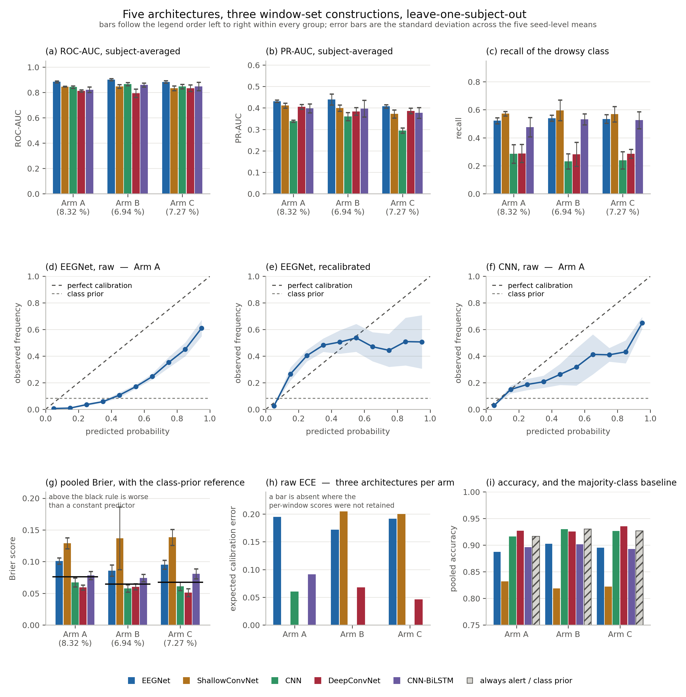

# Supplementary Material

**Calibration of Four-Channel EEG for Driver Drowsiness Detection:
A 750-Fold Leave-One-Subject-Out Study**

*This document is part of the published record and is submitted with the article.
Nothing here was shortened on its way out of the article: each section and table
below is the material as it stood in the manuscript, moved rather than rewritten.
`tools/split_map.json` records why each one is here, and what the article keeps in
its place so that the claim it supports is still made and still checkable there.*

*Cross-references of the form "Section 7.6" refer to the main article.*

## Supplementary Figure S1: the whole comparison on one page

Cited at the opening of Section 7 of the article. It is supplementary rather than a
main figure because its reliability panels can be drawn only for Arm A (the one
construction whose per-window scores are released) and the article reports findings
where they replicate on all three.

> **Figure S1. Five architectures, three constructions, one page.** (a)–(c) ranking
> and detection: ROC-AUC, PR-AUC and recall, subject-averaged, with error bars over
> the five seed-level means. (d)–(f) reliability diagrams **on Arm A, the one
> construction whose per-window scores are released**: EEGNet raw, EEGNet after
> out-of-subject recalibration, and the CNN raw, with the shaded band the spread
> across seeds. (g) pooled Brier score with **the class-prior reference drawn as a
> black rule in each group**: a bar above it is worse than a constant predictor.
> (h) raw expected calibration error, **subject-averaged**, unlike the pooled panels
> either side of it, and shown only for the three architectures per construction whose
> probabilities were retained, so a missing bar is missing coverage rather than a zero. (i) pooled accuracy with the always-alert baseline
> hatched. The large error bar on ShallowConvNet in (g) on Arm B is real: one of the
> five seeds gives 0.2246 against about 0.11 for the other four. This is the only
> figure in the paper that identifies architectures by colour, because five bars
> stand side by side in every group and position alone cannot name them; **within
> every group the bars follow the legend order from left to right**, so a bar can
> be identified by counting as well as by hue, and the palette was checked for
> colour-vision deficiency rather than chosen by eye.

## Supplementary Note 1: Dataset construction is verified, not assumed

The construction script performs two checks on every run and writes nothing unless
both pass. The **internal** check recomputes, from the raw counts that run itself
measured, what the budgeting must produce for each subject, and compares that with
what was produced; it uses no number from outside the run. The **reference** check
compares the totals and the ten per-subject drowsy counts against values previously
measured off the EDF files.

All three arms were rebuilt from the EDF files during the study and reproduced
their targets exactly: 9,260 / 770, 9,920 / 688 and 9,260 / 673, with all ten
per-subject counts matching in every case. The produced file carries its own provenance stamp: the trimming mode,
the balancing mode, the subject list and the per-subject drowsy counts are stored
alongside the arrays, and every downstream script asserts them before training.

**Table S1. Windows available per subject before any construction rule is applied.**
Counts pool each subject's two sessions. Prevalence here is the recording's own
drowsy fraction; the constructions in Table 1 change it.

| Subject | Windows | Drowsy | Alert | Prevalence |
|---|---|---|---|---|
| S1 | 1,232 | 83 | 1,149 | 6.74 % |
| S2 | 1,304 | 60 | 1,244 | 4.60 % |
| S3 | 1,085 | 178 | 907 | 16.41 % |
| S4 | 1,189 | 81 | 1,108 | 6.81 % |
| S5 | 1,279 | 61 | 1,218 | 4.77 % |
| S6 | 1,319 | 51 | 1,268 | 3.87 % |
| S7 | 992 | 239 | 753 | 24.09 % |
| S8 | 1,410 | 12 | 1,398 | 0.85 % |
| S9 | 1,431 | 7 | 1,424 | 0.49 % |
| S10 | 1,417 | 10 | 1,407 | 0.71 % |

## Supplementary Note 2: Where threshold selection helped, the scores were stably offset

Thresholds maximising F1 and maximising balanced accuracy were selected out of
subject, on the same nine-subject basis as the calibrators of Section 7.6, and applied
to the held-out subject. The analysis covers the three architectures per arm for
which probability files were retained, on **Arms A and C**; it was not run on Arm B.
Each entry is a paired test on the ten subject-level differences.

**Arm A**: CNN, CNN-BiLSTM, EEGNet

| Model | Rule | Balanced accuracy | F1 |
|---|---|---|---|
| CNN | F1-optimal | 0.618 → 0.616, p = 0.5703 | 0.267 → 0.260, p = 0.3750 |
| CNN | BA-optimal | 0.618 → 0.649, p = 0.2324 | 0.267 → 0.269, p = 1.0000 |
| CNN-BiLSTM | F1-optimal | 0.696 → 0.677, **p = 0.0488** | 0.361 → 0.354, p = 0.4961 |
| CNN-BiLSTM | BA-optimal | 0.696 → 0.717, p = 0.2324 | 0.361 → 0.334, p = 0.1055 |
| EEGNet | F1-optimal | 0.709 → 0.667, **p = 0.0273** | 0.389 → 0.348, p = 0.1641 |
| EEGNet | BA-optimal | 0.709 → 0.707, p = 0.8457 | 0.389 → 0.368, p = 0.3594 |

**Arm C**: DeepConvNet, EEGNet, ShallowConvNet

| Model | Rule | Balanced accuracy | F1 |
|---|---|---|---|
| DeepConvNet | F1-optimal | 0.628 → 0.661, **p = 0.0059** | 0.300 → 0.342, **p = 0.0273** |
| DeepConvNet | BA-optimal | 0.628 → 0.694, **p = 0.0137** | 0.300 → 0.330, p = 0.3750 |
| EEGNet | F1-optimal | 0.718 → 0.659, **p = 0.0098** | 0.382 → 0.330, p = 0.1641 |
| EEGNet | BA-optimal | 0.718 → 0.712, p = 0.6250 | 0.382 → 0.354, p = 0.1289 |
| ShallowConvNet | F1-optimal | 0.694 → 0.652, **p = 0.0488** | 0.312 → 0.313, p = 1.0000 |
| ShallowConvNet | BA-optimal | 0.694 → 0.690, p = 0.2324 | 0.312 → 0.307, p = 0.4922 |

**Across the twenty-four tests, seven changes reach significance: three gains and
four losses, and all three gains belong to one architecture.** DeepConvNet on Arm C
improves under both rules: balanced accuracy 0.628 → 0.661 and F1 0.300 → 0.342
under the F1-optimal rule, balanced accuracy 0.628 → 0.694 under the
balanced-accuracy rule. Every other architecture on either arm either does not move
or moves down, and all four losses are the same failure: the F1-optimal rule
lowering balanced accuracy.

The mechanism is visible in the selected thresholds themselves. **These ± are standard deviations over the fifty folds**, the third of the three conventions declared in Section 6.5 and the only place it is used: a threshold is chosen per fold, so there is no intermediate average to take. It blends subject and seed variation and is not comparable with the seed SDs elsewhere in this section; it says how widely a chosen threshold moves, not how uncertain a score is.

| Arm | Model | F1-optimal threshold | Balanced-accuracy-optimal threshold |
|---|---|---|---|
| A | CNN | 0.4606 ± 0.1626 | 0.0442 ± 0.0336 |
| A | CNN-BiLSTM | 0.6593 ± 0.1410 | 0.2081 ± 0.1255 |
| A | EEGNet | 0.6903 ± 0.0497 | 0.4092 ± 0.0492 |
| C | DeepConvNet | **0.3171 ± 0.0521** | 0.0958 ± 0.0352 |
| C | EEGNet | 0.7210 ± 0.0538 | 0.4192 ± 0.0404 |
| C | ShallowConvNet | 0.8257 ± 0.0581 | 0.4800 ± 0.0862 |

**In this analysis, threshold selection was effective in one case, and that case is
the one where the scores were stably offset in a single direction.** DeepConvNet on
Arm C is the one architecture whose F1-optimal threshold sits far *below* 0.5
(0.3171) with a small spread (0.0521): its scores are systematically shifted
relative to the default decision threshold by a consistent amount, so a single
number learned on nine subjects transfers to the tenth. A threshold below 0.5 says
where the useful cut lies; it does not by itself establish that the probabilities are
under-confident, which is a separate property and one this section does not measure.
The pattern is consistent with a stable score offset. It is **not** a general rule
about when threshold selection works: it rests on three architectures on each of two
arms, twenty-four comparisons of which seven reach the nominal level and none
survives either correction reported in Section 7.10. EEGNet and ShallowConvNet on the same arm
have thresholds far *above* 0.5 (0.7210, 0.8257) and lose balanced accuracy when the
F1-optimal rule is applied, because that rule trades recall for precision in
architectures that are already over-predicting the minority class. On Arm A the
CNN's F1-optimal threshold has a spread of 0.1626 on a mean of 0.4606 (a third of its own value), and nothing transfers at all.

There is a symmetry worth stating. **The architecture that needed recalibration
least (Section 7.6: DeepConvNet, whose raw calibration was already below the
reference, as was CNN's, and the only architecture Platt scaling improved on
neither Brier score nor calibration error, the CNN having failed only on the latter
at p = 0.0840) is the one that threshold selection helped most.** The two operations address the same
defect from opposite ends: recalibration reshapes the score distribution so that a
fixed threshold is correct, and threshold selection moves the threshold to where the
unreshaped distribution puts it. An architecture whose scores are already
well-shaped but shifted is helped by the second and not the first; an architecture
whose scores are mis-shaped is helped by the first and not the second.

Recalibration remains the preferable route in general, for three reasons: it applies
more widely: every architecture whose raw calibration was above the class-prior
reference improved significantly on both Brier score and expected calibration error,
six of six across the three arms, against one architecture of six that threshold
selection helped; the Platt route leaves the subject-averaged ranking metrics
unchanged at the reported precision, which was measured rather than guaranteed and
is *not* true of isotonic regression on the same folds (Section 6.6), and it
preserves a fixed, interpretable 0.5 threshold. But the blanket statement that threshold
selection never helps, made in an earlier analysis on Arm A evidence alone, is
withdrawn.

## Supplementary Note 3: Coverage of each analysis

Stated once, so that no section has to be read as covering more than it does.
**Table S3** gives it.

**Table S3. Which construction each analysis covers.** A blank is missing coverage,
not a null result: it means the files that analysis needs were not retained for
that construction. Every claim in Section 7 is bounded by the row it sits in.

| Analysis | Arm A | Arm B | Arm C |
|---|---|---|---|
| Ranking metrics, confusion matrices, Brier, degenerate folds | all 5 | all 5 | all 5 |
| Expected calibration error, subject-averaged | CNN, CNN-BiLSTM, EEGNet | DeepConvNet, EEGNet, ShallowConvNet | DeepConvNet, EEGNet, ShallowConvNet |
| Platt and isotonic recalibration | same 3 | same 3 | same 3 |
| Threshold selection | same 3 | not run | same 3 |
| Repeated-execution check | EEGNet only, and weaker (Section 7.9) | DeepConvNet, EEGNet, ShallowConvNet | not run |

Per-window probability files are what the last four rows require, and they were
retained for three architectures per arm. The Arm A set differs from the Arm B and
Arm C set, so all five architectures are covered on at least one construction, and
EEGNet on all three.

**Table S5. Multiplicity, per analysis family.** Comparisons performed, those reaching
the nominal level, and those surviving Benjamini–Hochberg and Benjamini–Yekutieli
*within that family*. Neither correction is this paper's decision rule; both are
sensitivity analyses, reported so that a reader can see what correction would do.
BH requires independence or positive regression dependency; BY holds under arbitrary
dependence. Bold marks the row covering all 190 comparisons, to separate it from the
per-family rows above it and the two-way split below. Generated by
`src/multiplicity.py` into `results/MULTIPLICITY.csv`.

| Family | Tests | Nominal | BH | BY |
|---|---|---|---|---|
| EEGNet against each other architecture, ROC-AUC | 12 | 11 | 10 | 8 |
| the other architecture pairs, ROC-AUC | 18 | 0 | 0 | 0 |
| ablation, CNN against CNN-BiLSTM | 9 | 8 | 8 | 6 |
| arm A against arm C, balancing isolated | 20 | 7 | 4 | 0 |
| arm B against arm C, trimming isolated | 20 | 0 | 0 | 0 |
| recalibration, Platt against raw | 18 | 13 | 5 | 3 |
| threshold selection against 0.5 | 24 | 7 | 0 | 0 |
| parameter count against ROC-AUC | 3 | 0 | 0 | 0 |
| cross-arm ordering agreement | 12 | 3 | 0 | 0 |
| ROC-AUC against pooled Brier | 6 | 0 | 0 | 0 |
| accuracy against pooled recall | 3 | 1 | 1 | 0 |
| drowsy-window count against PR-AUC | 45 | 32 | 32 | 30 |
| **all registered comparisons** | **190** | **82** | **57** | **24** |
| drowsy-count / prevalence family | 45 | 32 | 32 | 30 |
| remaining comparisons | 145 | 50 | 22 | 0 |

**Table S2. Pooled confusion matrices at the default 0.5 threshold, all three
constructions, complete.** This is Table 4 of the article with the four raw counts
restored. Counts are summed over the ten folds within a seed and then averaged over
the five seeds. The four count columns are seed means and carry no ±, since a count
rounded to the nearest window would carry a dispersion narrower than the rounding.
Recall and accuracy carry ± the standard deviation across the five seeds; precision
does not, for the reason given with Table 4.

| Arm | Model | TN | FP | FN | TP | Recall | Precision | Accuracy |
|---|--------|---|---|---|---|-----|---|------|
| **A** | DeepConvNet | 8,212 | 278 | 395 | 375 | 0.487 ± 0.105 | 0.574 | 92.73 ± 0.42 % |
| **A** | CNN | 8,095 | 395 | 380 | 390 | 0.506 ± 0.076 | 0.497 | 91.63 ± 1.17 % |
| **A** | CNN-BiLSTM | 7,800 | 690 | 272 | 498 | 0.646 ± 0.124 | 0.419 | 89.61 ± 0.93 % |
| **A** | EEGNet | 7,631 | 859 | 187 | 583 | 0.758 ± 0.019 | 0.405 | 88.71 ± 0.81 % |
| **A** | ShallowConvNet | 7,090 | 1,400 | 158 | 612 | 0.794 ± 0.017 | 0.304 | 83.17 ± 1.35 % |
| **B** | CNN | 8,966 | 266 | 428 | 260 | 0.377 ± 0.121 | 0.494 | 93.00 ± 0.90 % |
| **B** | DeepConvNet | 8,871 | 361 | 379 | 309 | 0.449 ± 0.186 | 0.461 | 92.54 ± 1.01 % |
| **B** | EEGNet | 8,420 | 812 | 157 | 531 | 0.772 ± 0.028 | 0.395 | 90.23 ± 1.35 % |
| **B** | CNN-BiLSTM | 8,491 | 741 | 235 | 453 | 0.658 ± 0.120 | 0.380 | 90.17 ± 1.22 % |
| **B** | ShallowConvNet | 7,578 | 1,654 | 146 | 542 | 0.787 ± 0.055 | 0.247 | 81.85 ± 6.22 % |
| **C** | DeepConvNet | 8,328 | 259 | 338 | 335 | 0.498 ± 0.043 | 0.564 | 93.56 ± 0.69 % |
| **C** | CNN | 8,247 | 340 | 341 | 332 | 0.493 ± 0.071 | 0.494 | 92.65 ± 1.09 % |
| **C** | EEGNet | 7,759 | 828 | 145 | 528 | 0.785 ± 0.021 | 0.390 | 89.50 ± 1.27 % |
| **C** | CNN-BiLSTM | 7,774 | 813 | 180 | 493 | 0.732 ± 0.062 | 0.377 | 89.28 ± 0.87 % |
| **C** | ShallowConvNet | 7,092 | 1,495 | 155 | 518 | 0.770 ± 0.057 | 0.257 | 82.19 ± 1.54 % |

**Table S4. Expected calibration error and Brier score, raw and after each
recalibration, all three constructions, complete.** This is Table 6 of the article
with the three expected-calibration-error columns restored. Only three architectures
per construction retained per-window probabilities, and the two sets differ, so
between them all five are covered and only EEGNet is covered on all three. Bold marks
a Brier + Platt value that Platt recalibration carried from above the construction's
class-prior Brier reference to below it.

| Arm | Model | ECE raw | ECE + Platt | ECE + isotonic | Brier raw | Brier + Platt | Brier + isotonic |
|---|--------|---|-----|-----|---|-----|-----|
| **A** | CNN | 0.0605 | 0.0447 | 0.0473 | 0.0671 | 0.0585 | 0.0604 |
| **A** | CNN-BiLSTM | 0.0912 | 0.0561 | 0.0584 | 0.0781 | **0.0590** | 0.0599 |
| **A** | EEGNet | 0.1950 | 0.0625 | 0.0603 | 0.1009 | **0.0635** | 0.0610 |
| **B** | DeepConvNet | 0.0679 | 0.0631 | 0.0613 | 0.0603 | 0.0592 | 0.0577 |
| **B** | EEGNet | 0.1717 | 0.0547 | 0.0548 | 0.0859 | **0.0538** | 0.0522 |
| **B** | ShallowConvNet | 0.2049 | 0.0605 | 0.0595 | 0.1369 | **0.0584** | 0.0583 |
| **C** | DeepConvNet | 0.0460 | 0.0502 | 0.0509 | 0.0511 | 0.0529 | 0.0528 |
| **C** | EEGNet | 0.1918 | 0.0580 | 0.0576 | 0.0952 | **0.0573** | 0.0551 |
| **C** | ShallowConvNet | 0.2001 | 0.0724 | 0.0709 | 0.1383 | **0.0658** | 0.0663 |

